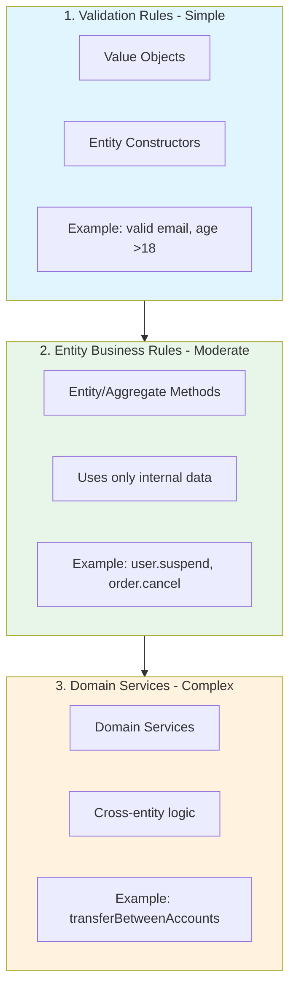

# 3. Domain Layer - Business Logic

> Part of the [Hexagonal & DDD in NestJS Implementation Guide](../NESTJS_DDD_COOKBOOK.md)

In DDD, **Business Rules** have specific locations depending on their complexity and scope.

## 3 Types of Business Rules



---

## 1. Validation Rules (Value Objects)

**When**: Rules that validate a **single value** (email, phone, age).

**Where**: `domain/value-objects/`

**NestJS**: ❌ DO NOT use `@Injectable`, they are pure TypeScript classes.

```typescript
// domain/value-objects/email.vo.ts
export class Email {
  private readonly value: string;

  constructor(value: string) {
    // ✅ Business Rule: Email must have valid format
    if (!this.isValid(value)) {
      throw new InvalidEmailError(value);
    }
    this.value = value.toLowerCase();
  }

  private isValid(email: string): boolean {
    const regex = /^[^\s@]+@[^\s@]+\.[^\s@]+$/;
    return regex.test(email);
  }

  toString(): string {
    return this.value;
  }

  equals(other: Email): boolean {
    return this.value === other.value;
  }
}
```

```typescript
// domain/value-objects/age.vo.ts
export class Age {
  private readonly value: number;

  constructor(value: number) {
    // ✅ Business Rule: Age must be between 0 and 150
    if (value < 0 || value > 150) {
      throw new InvalidAgeError(value);
    }
    this.value = value;
  }

  // ✅ Business Rule: Adult is >=18
  isAdult(): boolean {
    return this.value >= 18;
  }

  getValue(): number {
    return this.value;
  }
}
```

### Value Object Base Class Pattern (Recommended)

For consistency across all Value Objects, use a base class that enforces common contracts:

```typescript
// shared-kernel/domain/value-objects/value-object.ts
export abstract class ValueObject<T> {
  protected readonly value: T;

  constructor(value: T) {
    this.value = value;
  }

  abstract equals(other: ValueObject<T>): boolean;
  abstract toString(): string;
}
```

**Benefits**:

- **Immutability by design**: All VOs inherit protected readonly value
- **Consistent API**: All VOs implement `equals()` and `toString()`
- **Type safety**: Generic type `T` enforces type consistency
- **Less boilerplate**: Common logic inherited

**Usage example**:

```typescript
// domain/value-objects/user-type.vo.ts
export class UserType extends ValueObject<'client' | 'staff'> {
  private constructor(value: 'client' | 'staff') {
    super(value);
  }

  static create(value: string): UserType {
    if (value !== 'client' && value !== 'staff') {
      throw new InvalidUserTypeException(value);
    }
    return new UserType(value);
  }

  static client(): UserType {
    return new UserType('client');
  }

  static staff(): UserType {
    return new UserType('staff');
  }

  isClient(): boolean {
    return this.value === 'client';
  }

  isStaff(): boolean {
    return this.value === 'staff';
  }

  equals(other: UserType): boolean {
    return this.value === other.value;
  }

  toString(): string {
    return this.value;
  }
}

// Usage
const userType = UserType.client();
if (userType.isStaff()) {
  // Business logic
}
```

### Value Object Factory Methods (Best Practice)

Factory methods provide **named constructors** for clarity and encapsulation:

```typescript
// domain/value-objects/email.vo.ts
export class Email extends ValueObject<string> {
  constructor(value: string) {
    super(value.toLowerCase());
    if (!this.isValid(value)) {
      throw new InvalidEmailError(value);
    }
  }

  // ✅ Factory methods for common patterns
  static fromString(value: string): Email {
    return new Email(value);
  }

  static corporate(username: string, domain: string): Email {
    return new Email(`${username}@${domain}`);
  }

  static personal(username: string): Email {
    return new Email(`${username}@gmail.com`);
  }

  private isValid(value: string): boolean {
    return /^[^\s@]+@[^\s@]+\.[^\s@]+$/.test(value);
  }

  // ✅ Behavior methods (not just validation)
  getDomain(): string {
    return this.value.split('@')[1];
  }

  isPersonalEmail(): boolean {
    const personalDomains = ['gmail.com', 'yahoo.com', 'hotmail.com'];
    return personalDomains.includes(this.getDomain());
  }

  equals(other: Email): boolean {
    return this.value === other.value;
  }
}

// Usage
const email1 = Email.corporate('john', 'acme.com'); // ✅ Clear intent
const email2 = Email.personal('jane'); // ✅ Obvious meaning
const email3 = Email.fromString('user@example.com'); // ✅ Explicit

if (email1.isPersonalEmail()) {
  // Business logic
}
```

**Benefits of factory methods**:

- **Readability**: `PermissionUserType.all()` vs `new PermissionUserType('*')`
- **Encapsulation**: Construction logic lives in VO
- **Type safety**: Factory methods with specific types
- **Discoverability**: IDE auto-completion shows available factories

---

## 2. Entity Business Rules (Entity methods)

**When**: Rules that modify the **internal state** of an entity.

**Where**: `domain/entities/` or `domain/aggregates/`

**NestJS**: ❌ DO NOT use `@Injectable`, they are pure TypeScript classes.

```typescript
// domain/entities/user.entity.ts
export class User extends AggregateRoot {
  private constructor(
    private readonly id: string,
    private email: Email,
    private status: UserStatus, // 'active' | 'suspended' | 'deleted'
    private failedLoginAttempts: number = 0,
  ) {
    super();
  }

  static create(id: string, email: Email): User {
    const user = new User(id, email, 'active');
    user.record(new UserCreatedEvent(id, email.toString()));
    return user;
  }

  // ✅ Business Rule: User can change email if active
  changeEmail(newEmail: Email): void {
    if (this.status !== 'active') {
      throw new UserNotActiveError(this.id);
    }

    if (this.email.equals(newEmail)) {
      throw new EmailAlreadySetError();
    }

    const oldEmail = this.email;
    this.email = newEmail;

    this.record(new UserEmailChangedEvent(this.id, oldEmail, newEmail));
  }

  // ✅ Business Rule: User is suspended after 5 failed attempts
  recordFailedLogin(): void {
    this.failedLoginAttempts++;

    if (this.failedLoginAttempts >= 5) {
      this.status = 'suspended';
      this.record(
        new UserSuspendedEvent(this.id, 'Too many failed login attempts'),
      );
    }
  }

  // ✅ Business Rule: Only active users can be suspended
  suspend(reason: string): void {
    if (this.status === 'deleted') {
      throw new CannotSuspendDeletedUserError(this.id);
    }

    if (this.status === 'suspended') {
      return; // Already suspended, no-op
    }

    this.status = 'suspended';
    this.record(new UserSuspendedEvent(this.id, reason));
  }

  // ✅ Business Rule: User must be suspended to reactivate
  reactivate(): void {
    if (this.status !== 'suspended') {
      throw new UserNotSuspendedError(this.id);
    }

    this.status = 'active';
    this.failedLoginAttempts = 0;
    this.record(new UserReactivatedEvent(this.id));
  }

  // Getters (without business logic)
  getId(): string {
    return this.id;
  }
  getEmail(): Email {
    return this.email;
  }
  getStatus(): UserStatus {
    return this.status;
  }
  isActive(): boolean {
    return this.status === 'active';
  }
}
```

### Example: Order Aggregate

```typescript
// domain/aggregates/order.aggregate.ts
export class Order extends AggregateRoot {
  private constructor(
    private readonly id: string,
    private items: OrderItem[],
    private status: OrderStatus, // 'pending' | 'paid' | 'shipped' | 'cancelled'
    private total: Money,
  ) {
    super();
  }

  // ✅ Business Rule: Minimum total to create order is $10
  static create(id: string, items: OrderItem[]): Order {
    if (items.length === 0) {
      throw new OrderMustHaveItemsError();
    }

    const total = items.reduce(
      (sum, item) => sum.add(item.getPrice()),
      Money.zero(),
    );

    if (total.lessThan(Money.fromCents(1000))) {
      // $10 minimum
      throw new OrderBelowMinimumError(total);
    }

    const order = new Order(id, items, 'pending', total);
    order.record(new OrderCreatedEvent(id, total));
    return order;
  }

  // ✅ Business Rule: Only pending orders can be cancelled
  cancel(reason: string): void {
    if (this.status !== 'pending') {
      throw new OrderCannotBeCancelledError(this.id, this.status);
    }

    this.status = 'cancelled';
    this.record(new OrderCancelledEvent(this.id, reason));
  }

  // ✅ Business Rule: Only pending orders can be paid
  markAsPaid(): void {
    if (this.status !== 'pending') {
      throw new OrderAlreadyProcessedError(this.id);
    }

    this.status = 'paid';
    this.record(new OrderPaidEvent(this.id, this.total));
  }
}
```

---

## 3. Domain Services (cross-entity logic)

> **Theoretical Foundation**: For complete understanding of Domain Services, when to use them, and patterns, see [HEXAGONAL_ARCHITECTURE.md - Domain Services](../architecture/HEXAGONAL_ARCHITECTURE.md#domain-services).

Domain Services are **optional** - most use cases don't need them. Use only when business logic spans multiple aggregates or involves complex calculations.

**When**: Rules that require **multiple entities** or logic that doesn't belong to any specific entity.

**Where**: `domain/services/`

**NestJS**: ✅ **YES use `@Injectable()`** for dependency injection, but **NEVER inject Ports** (ForStoringUsers, etc.) - Domain Services must be pure.

```typescript
// domain/services/transfer-money.domain-service.ts
import { Injectable } from '@nestjs/common';
import { Account } from '../entities/account.entity';
import { Money } from '@shared-kernel/domain/value-objects/money.vo';
import { DomainEvent } from '@shared-kernel/domain/event/domain-event.interface';

@Injectable()
export class TransferMoneyDomainService {
  // ✅ Business Rule: Transfer requires validating both accounts
  transfer(from: Account, to: Account, amount: Money): void {
    // ✅ Rule: Cannot transfer to same account
    if (from.getId() === to.getId()) {
      throw new CannotTransferToSameAccountError();
    }

    // ✅ Rule: Both accounts must be active
    if (!from.isActive() || !to.isActive()) {
      throw new AccountNotActiveError();
    }

    // ✅ Rule: Source account must have sufficient funds
    if (!from.hasSufficientBalance(amount)) {
      throw new InsufficientFundsError(from.getId(), amount);
    }

    // Execute changes in both entities (each accumulates its own events)
    from.withdraw(amount);
    to.deposit(amount);
  }
}
```

```typescript
// domain/services/pricing.domain-service.ts
import { Injectable } from '@nestjs/common';
import { Product } from '../entities/product.entity';
import { Customer } from '../entities/customer.entity';
import { Money } from '@shared-kernel/domain/value-objects/money.vo';

@Injectable()
export class PricingDomainService {
  // ✅ Business Rule: Price depends on customer type and volume
  calculatePrice(
    product: Product,
    customer: Customer,
    quantity: number,
  ): Money {
    let basePrice = product.getPrice();

    // ✅ Rule: VIP customers have 20% discount
    if (customer.isVIP()) {
      basePrice = basePrice.multiplyBy(0.8);
    }

    // ✅ Rule: Volume discount (>10 units = 10% off)
    if (quantity > 10) {
      basePrice = basePrice.multiplyBy(0.9);
    }

    return basePrice.multiplyBy(quantity);
  }
}
```

---

## Using Domain Services in Use Cases

```typescript
// application/use-cases/transfer-money/transfer-money.use-case.ts
import { Inject, Injectable } from '@nestjs/common';
import { TransferMoneyDomainService } from '@core/banking/domain/services/transfer-money.domain-service';
import { FOR_STORING_ACCOUNTS } from '../../ports/output/for-storing-accounts.port';

@Injectable()
export class TransferMoneyUseCase {
  constructor(
    @Inject(FOR_STORING_ACCOUNTS)
    private readonly accountStorage: ForStoringAccounts,
    private readonly transferService: TransferMoneyDomainService, // ✅ Domain Service
  ) {}

  async execute(input: TransferMoneyInput): Promise<TransferMoneyOutput> {
    // 1. Load aggregates
    const fromAccount = await this.accountStorage.findById(input.fromAccountId);
    const toAccount = await this.accountStorage.findById(input.toAccountId);

    if (!fromAccount || !toAccount) {
      throw new AccountNotFoundError();
    }

    // 2. Execute domain logic (Business Rules in Domain Service)
    this.transferService.transfer(
      fromAccount,
      toAccount,
      Money.fromCents(input.amountCents),
    );

    // 3. Persist changes (repositories publish domain events)
    await this.accountStorage.save(fromAccount);
    await this.accountStorage.save(toAccount);

    return { success: true };
  }
}
```

---

## Summary: Where Business Rules Go

| Component            | Location                 | `@Injectable`?  | Responsibilities                            | Can inject Ports?        |
| -------------------- | ------------------------ | --------------- | ------------------------------------------- | ------------------------ |
| **Value Object**     | `domain/value-objects/`  | ❌ NO           | Validation, immutable values                | ❌ NO                    |
| **Entity/Aggregate** | `domain/entities/`       | ❌ NO           | State + behavior, invariants                | ❌ NO                    |
| **Domain Service**   | `domain/services/`       | ✅ YES (for DI) | Multi-aggregate logic, complex calculations | ❌ **NO** - Must be pure |
| **Use Case**         | `application/use-cases/` | ✅ YES          | Orchestration, transaction boundaries       | ✅ **YES** - Uses Ports  |

### Architecture Pattern in This Project

```typescript
// ✅ CORRECT PATTERN
Use Case (Application Layer):
  1. Inject Port (ForStoringAccounts) ← abstraction
  2. Inject Domain Service (optional)
  3. Load entities via Port
  4. Delegate business logic to:
     - Entity methods (single entity logic)
     - Domain Service (multi-entity logic)
  5. Persist via Port
  6. Return output

Domain Service (Domain Layer):
  - Pure business logic only
  - Operates on Entities/VOs passed as parameters
  - NO Ports, NO persistence
  - Can inject other Domain Services
```

### Golden Rules

- ✅ **Business logic ALWAYS in Domain** (Entities or Domain Services) - NEVER in Use Cases
- ✅ **PREFER Entity methods** when logic involves single entity
- ✅ **USE Domain Services** only for multi-aggregate coordination or complex calculations
- ✅ **Use Cases orchestrate** - load via Ports, delegate to Domain, persist via Ports
- ❌ **NEVER inject Ports in Domain Services** - they must be pure and testable
- ❌ **NEVER put business rules** in Controllers, DTOs, or Use Cases
- ❌ **NEVER import infrastructure** (`PrismaService`, `TypeOrmRepository`) in Domain layer

### Decision Guide

| Question                            | Answer | Put logic in...                       |
| ----------------------------------- | ------ | ------------------------------------- |
| Single entity? Simple logic?        | Yes    | Entity method                         |
| Single entity? Complex calculation? | Yes    | Domain Service (or Entity if fits)    |
| Multiple entities? Any logic?       | Yes    | Domain Service                        |
| Need to load/save entities?         | Yes    | Use Case (orchestration)              |
| Just CRUD, no business rules?       | Yes    | Use Case + Entity (no Domain Service) |

---

**Navigation:** [Previous: Project Structure](./02-project-structure.md) | [Up](../NESTJS_DDD_COOKBOOK.md) | [Next: Application Layer](./04-application-layer.md)
