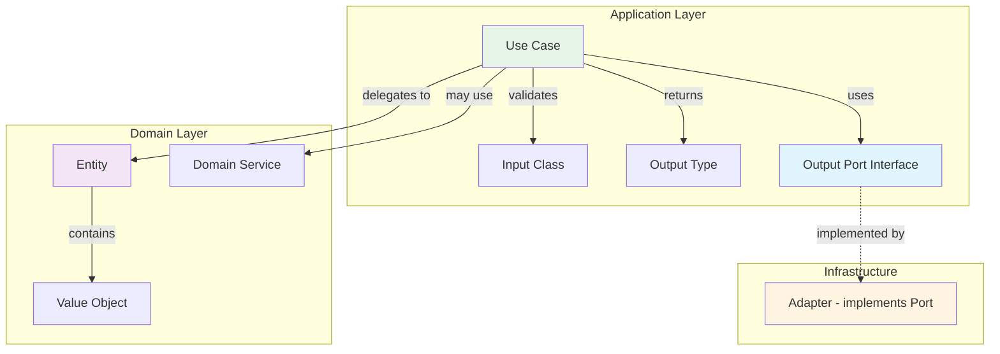

# 4. Application Layer - Use Cases & Ports

> Part of the [Hexagonal & DDD in NestJS Implementation Guide](../NESTJS_DDD_COOKBOOK.md)

The Application Layer contains **Use Cases** (orchestration) and **Ports** (abstractions for external dependencies).

## Use Cases

**What**: Orchestrators that coordinate domain objects to fulfill a user action.

**Where**: `application/use-cases/[action-entity]/`

**Responsibilities**:

- Load entities via output ports
- Delegate business logic to entities or domain services
- Persist changes via output ports
- Return output types

**Rules**:

- ✅ Use `@Injectable()` for dependency injection
- ✅ Inject ports (abstractions), never adapters
- ✅ Return plain types, not classes
- ❌ NO business logic - delegate to domain
- ❌ NO infrastructure imports (Prisma, TypeORM, etc.)

### Use Case Structure

```
application/use-cases/
└── create-user/
    ├── create-user.use-case.ts       # Orchestrator
    ├── create-user.input.ts          # Input contract (class)
    ├── create-user.output.ts         # Output contract (type)
    └── create-user.use-case.spec.ts  # Unit tests
```

### Example: Complete Use Case

**Input (Class with validation)**:

```typescript
// application/use-cases/create-user/create-user.input.ts
export class CreateUserInput {
  readonly id: string;
  readonly email: string;

  constructor(data: { id: string; email: string }) {
    if (!data.id || !data.email) {
      throw new ValidationException('Missing required fields');
    }
    this.id = data.id;
    this.email = data.email;
  }
}
```

**Output (Type - plain data)**:

```typescript
// application/use-cases/create-user/create-user.output.ts
export type CreateUserOutput = {
  id: string;
  email: string;
  status: string;
};
```

**Use Case (Orchestrator)**:

```typescript
// application/use-cases/create-user/create-user.use-case.ts
import { Inject, Injectable } from '@nestjs/common';
import {
  FOR_STORING_USERS,
  ForStoringUsers,
} from '../../ports/output/for-storing-users.port';
import { User } from '../../../domain/entities/user.entity';
import { Email } from '@shared-kernel/domain/value-objects/email.vo';
import { CreateUserInput } from './create-user.input';
import { CreateUserOutput } from './create-user.output';

@Injectable()
export class CreateUserUseCase {
  constructor(
    @Inject(FOR_STORING_USERS)
    private readonly userStorage: ForStoringUsers,
  ) {}

  async execute(input: CreateUserInput): Promise<CreateUserOutput> {
    // 1. Check if user exists
    const existing = await this.userStorage.findByEmail(
      new Email(input.email),
    );
    if (existing) {
      throw new UserAlreadyExistsException(input.email);
    }

    // 2. Create entity (business logic in entity)
    const user = User.create(input.id, new Email(input.email));

    // 3. Persist
    await this.userStorage.save(user);

    // 4. Return plain data
    return {
      id: user.getId(),
      email: user.getEmail().toString(),
      status: user.getStatus(),
    };
  }
}
```

**Unit Test (Mock ports)**:

```typescript
// application/use-cases/create-user/create-user.use-case.spec.ts
import { Test } from '@nestjs/testing';
import { CreateUserUseCase } from './create-user.use-case';
import { FOR_STORING_USERS } from '../../ports/output/for-storing-users.port';
import { UserAlreadyExistsException } from '../../../domain/exceptions/user.exceptions';

describe('CreateUserUseCase', () => {
  let useCase: CreateUserUseCase;
  let mockStorage: any;

  beforeEach(async () => {
    mockStorage = {
      save: jest.fn(),
      findByEmail: jest.fn(),
    };

    const module = await Test.createTestingModule({
      providers: [
        CreateUserUseCase,
        { provide: FOR_STORING_USERS, useValue: mockStorage },
      ],
    }).compile();

    useCase = module.get(CreateUserUseCase);
  });

  it('should create user when email is unique', async () => {
    mockStorage.findByEmail.mockResolvedValue(null);

    const result = await useCase.execute({
      id: 'uuid-123',
      email: 'john@example.com',
    });

    expect(result.email).toBe('john@example.com');
    expect(mockStorage.save).toHaveBeenCalledTimes(1);
  });

  it('should throw when email already exists', async () => {
    mockStorage.findByEmail.mockResolvedValue({});

    await expect(
      useCase.execute({ id: 'uuid-123', email: 'john@example.com' }),
    ).rejects.toThrow(UserAlreadyExistsException);
  });
});
```

---

## Ports (Abstractions)

Ports define **WHAT** the application needs, not **HOW** it's implemented.

### Port Types

**Primary Ports (Input)** - Optional, only for multiple consumers:

- Pattern: `ForManaging[Entity]`
- Location: `application/ports/input/`
- Implemented by: Use Cases
- Used by: Multiple presentation layers (HTTP, GraphQL, CLI)

**Secondary Ports (Output)** - Required for external dependencies:

- Pattern: `ForStoring[Entity]`, `ForSending[Something]`
- Location: `application/ports/output/`
- Implemented by: Adapters (infrastructure)
- Used by: Use Cases

### Port Naming Convention

**✅ Correct - Capability-oriented**:

```typescript
// Output ports
export interface ForStoringUsers {}
export interface ForSendingEmails {}
export interface ForPublishingEvents {}
export interface ForGeneratingPDFs {}

// Input ports (optional)
export interface ForManagingUsers {}
export interface ForPlacingOrders {}
```

**❌ Avoid - Technology-oriented**:

```typescript
// Implies technology, not capability
export interface UserRepository {} // Implies database
export interface EmailService {} // Generic
export interface SMTPAdapter {} // This is adapter, not port
```

### Dependency Injection Tokens

Use Symbol for type-safe DI:

```typescript
// application/ports/output/for-storing-users.port.ts
export interface ForStoringUsers {
  save(user: User): Promise<void>;
  findByEmail(email: Email): Promise<User | null>;
  findById(id: string): Promise<User | null>;
  delete(id: string): Promise<void>;
}

// Token for dependency injection
export const FOR_STORING_USERS = Symbol('FOR_STORING_USERS');
```

### Complete Port Example

```typescript
// application/ports/output/for-storing-users.port.ts
import { User } from '../../../domain/entities/user.entity';
import { Email } from '@shared-kernel/domain/value-objects/email.vo';

export interface ForStoringUsers {
  save(user: User): Promise<void>;
  findByEmail(email: Email): Promise<User | null>;
  findById(id: string): Promise<User | null>;
  delete(id: string): Promise<void>;
}

export const FOR_STORING_USERS = Symbol('FOR_STORING_USERS');
```

```typescript
// application/ports/output/for-sending-emails.port.ts
export interface ForSendingEmails {
  sendWelcomeEmail(to: Email, userName: string): Promise<void>;
  sendPasswordResetEmail(to: Email, resetToken: string): Promise<void>;
}

export const FOR_SENDING_EMAILS = Symbol('FOR_SENDING_EMAILS');
```

### Using Ports in Use Cases

```typescript
import { Inject, Injectable } from '@nestjs/common';
import {
  FOR_STORING_USERS,
  ForStoringUsers,
} from '../../ports/output/for-storing-users.port';
import {
  FOR_SENDING_EMAILS,
  ForSendingEmails,
} from '../../ports/output/for-sending-emails.port';

@Injectable()
export class CreateUserUseCase {
  constructor(
    @Inject(FOR_STORING_USERS)
    private readonly userStorage: ForStoringUsers,
    @Inject(FOR_SENDING_EMAILS)
    private readonly emailSender: ForSendingEmails,
  ) {}

  async execute(input: CreateUserInput): Promise<CreateUserOutput> {
    const user = User.create(input.id, new Email(input.email));

    await this.userStorage.save(user);
    await this.emailSender.sendWelcomeEmail(
      user.getEmail(),
      user.getName(),
    );

    return {
      id: user.getId(),
      email: user.getEmail().toString(),
    };
  }
}
```

---

## Using Domain Services in Use Cases

When business logic spans multiple entities, inject domain services:

```typescript
import { Inject, Injectable } from '@nestjs/common';
import { TransferMoneyDomainService } from '@core/banking/domain/services/transfer-money.domain-service';
import { FOR_STORING_ACCOUNTS } from '../../ports/output/for-storing-accounts.port';

@Injectable()
export class TransferMoneyUseCase {
  constructor(
    @Inject(FOR_STORING_ACCOUNTS)
    private readonly accountStorage: ForStoringAccounts,
    private readonly transferService: TransferMoneyDomainService,
  ) {}

  async execute(input: TransferMoneyInput): Promise<TransferMoneyOutput> {
    // 1. Load aggregates via port
    const fromAccount = await this.accountStorage.findById(input.fromAccountId);
    const toAccount = await this.accountStorage.findById(input.toAccountId);

    if (!fromAccount || !toAccount) {
      throw new AccountNotFoundException();
    }

    // 2. Delegate to domain service (business logic)
    this.transferService.transfer(
      fromAccount,
      toAccount,
      Money.fromCents(input.amountCents),
    );

    // 3. Persist via port
    await this.accountStorage.save(fromAccount);
    await this.accountStorage.save(toAccount);

    return { success: true };
  }
}
```

---

## Input Ports (Optional)

Use input ports when:

- Multiple presentation layers consume same use cases (HTTP + GraphQL + CLI)
- Building a library that others will integrate
- Need to enforce consistent API across entry points

**Example**:

```typescript
// application/ports/input/for-managing-users.port.ts
export interface ForManagingUsers {
  createUser(data: CreateUserInput): Promise<CreateUserOutput>;
  updateUser(id: string, data: UpdateUserInput): Promise<UpdateUserOutput>;
  deleteUser(id: string): Promise<void>;
}

export const FOR_MANAGING_USERS = Symbol('FOR_MANAGING_USERS');
```

```typescript
// application/use-cases/users.facade.ts
@Injectable()
export class UsersFacade implements ForManagingUsers {
  constructor(
    private readonly createUserUseCase: CreateUserUseCase,
    private readonly updateUserUseCase: UpdateUserUseCase,
    private readonly deleteUserUseCase: DeleteUserUseCase,
  ) {}

  async createUser(data: CreateUserInput): Promise<CreateUserOutput> {
    return this.createUserUseCase.execute(data);
  }

  async updateUser(
    id: string,
    data: UpdateUserInput,
  ): Promise<UpdateUserOutput> {
    return this.updateUserUseCase.execute({ id, ...data });
  }

  async deleteUser(id: string): Promise<void> {
    return this.deleteUserUseCase.execute({ id });
  }
}
```

**Skip input ports** for most projects - use cases are already the entry point.

---

## Architecture Summary



---

**Navigation:** [Previous: Domain Layer](./03-domain-layer.md) | [Up](../NESTJS_DDD_COOKBOOK.md) | [Next: Infrastructure Layer](./05-infrastructure-layer.md)
