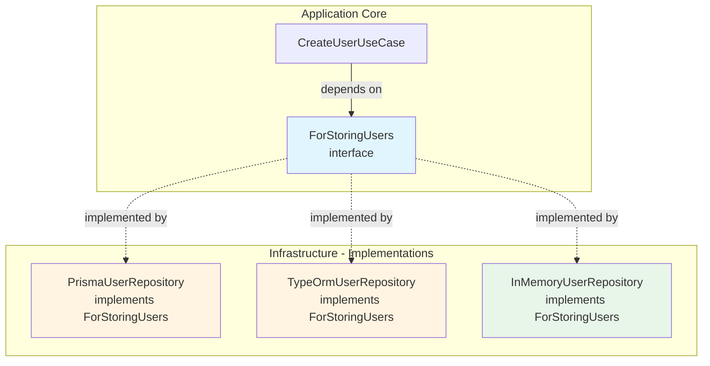

# 5. Infrastructure Layer - Adapters & NestJS Integration

> Part of the [Hexagonal & DDD in NestJS Implementation Guide](../NESTJS_DDD_COOKBOOK.md)

The Infrastructure Layer contains **adapters** that implement **ports** using specific technologies.

## Ports vs Adapters

### Fundamental Difference

**Port (Interface in `application/ports/output/`)**:

- Defines **WHAT** operations the application needs
- Is a **pure TypeScript interface**
- Does **NOT know** how it's implemented (Prisma, TypeORM, SendGrid, etc.)
- Defines the **contract** that adapters must fulfill

**Adapter (Implementation in `infrastructure/adapters/`)**:

- Defines **HOW** operations are executed
- Is a **NestJS class** (`@Injectable()`)
- **DOES know** the concrete technology (Prisma, SendGrid, AWS SDK)
- **Implements** the Port contract

### Conceptual Diagram



---

## Complete Example: Multiple Adapters

### 1. Port (Interface in Application)

```typescript
// application/ports/output/for-storing-users.port.ts
import { User } from '../../../domain/entities/user.entity';
import { Email } from '@shared-kernel/domain/value-objects/email.vo';

export interface ForStoringUsers {
  save(user: User): Promise<void>;
  findByEmail(email: Email): Promise<User | null>;
  findById(id: string): Promise<User | null>;
  delete(id: string): Promise<void>;
}

// Token for dependency injection
export const FOR_STORING_USERS = Symbol('FOR_STORING_USERS');
```

### 2. Adapters (Implementations in Infrastructure)

#### Prisma Adapter

```typescript
// infrastructure/adapters/persistence/prisma-user.repository.ts
import { Injectable, Inject } from '@nestjs/common';
import { PrismaService } from '@shared-kernel/infrastructure/adapters/persistence/prisma.service';
import { ForStoringUsers } from '@supporting/user/application/ports/output/for-storing-users.port';
import { User } from '@supporting/user/domain/entities/user.entity';
import { Email } from '@shared-kernel/domain/value-objects/email.vo';
import {
  EventBusPort,
  EVENT_BUS,
} from '@shared-kernel/infrastructure/event-bus';

@Injectable()
export class PrismaUserRepository implements ForStoringUsers {
  constructor(
    private readonly prisma: PrismaService,
    @Inject(EVENT_BUS) private readonly eventBus: EventBusPort,
  ) {}

  async save(user: User): Promise<void> {
    // 1. Extract events (atomic: extracts and clears)
    const events = user.pullEvents();

    // 2. Persist entity
    await this.prisma.user.upsert({
      where: { id: user.getId() },
      create: {
        id: user.getId(),
        email: user.getEmail().toString(),
        status: user.getStatus(),
      },
      update: {
        email: user.getEmail().toString(),
        status: user.getStatus(),
      },
    });

    // 3. Publish events AFTER successful persistence
    if (events.length > 0) {
      await this.eventBus.publish(events);
    }
  }

  async findByEmail(email: Email): Promise<User | null> {
    const row = await this.prisma.user.findUnique({
      where: { email: email.toString() },
    });
    // Use reconstitute for existing entities (no events)
    return row ? User.reconstitute(row.id, row.email, row.status) : null;
  }

  async findById(id: string): Promise<User | null> {
    const row = await this.prisma.user.findUnique({ where: { id } });
    return row ? User.reconstitute(row.id, row.email, row.status) : null;
  }

  async delete(id: string): Promise<void> {
    await this.prisma.user.delete({ where: { id } });
  }
}
```

#### TypeORM Adapter (Alternative)

```typescript
// infrastructure/adapters/persistence/typeorm-user.repository.ts
import { Injectable } from '@nestjs/common';
import { InjectRepository } from '@nestjs/typeorm';
import { Repository } from 'typeorm';
import { ForStoringUsers } from '@supporting/user/application/ports/output/for-storing-users.port';
import { User } from '@supporting/user/domain/entities/user.entity';
import { Email } from '@shared-kernel/domain/value-objects/email.vo';
import { UserEntity } from './user.entity';

@Injectable()
export class TypeOrmUserRepository implements ForStoringUsers {
  constructor(
    @InjectRepository(UserEntity)
    private readonly repo: Repository<UserEntity>,
  ) {}

  async save(user: User): Promise<void> {
    await this.repo.save({
      id: user.getId(),
      email: user.getEmail().toString(),
      status: user.getStatus(),
    });
  }

  async findByEmail(email: Email): Promise<User | null> {
    const row = await this.repo.findOne({
      where: { email: email.toString() },
    });
    return row ? User.reconstitute(row.id, row.email, row.status) : null;
  }

  async findById(id: string): Promise<User | null> {
    const row = await this.repo.findOne({ where: { id } });
    return row ? User.reconstitute(row.id, row.email, row.status) : null;
  }

  async delete(id: string): Promise<void> {
    await this.repo.delete({ id });
  }
}
```

#### In-Memory Adapter (For Tests)

```typescript
// infrastructure/adapters/persistence/in-memory-user.repository.ts
import { Injectable } from '@nestjs/common';
import { ForStoringUsers } from '@supporting/user/application/ports/output/for-storing-users.port';
import { User } from '@supporting/user/domain/entities/user.entity';
import { Email } from '@shared-kernel/domain/value-objects/email.vo';

@Injectable()
export class InMemoryUserRepository implements ForStoringUsers {
  private users = new Map<string, User>();

  async save(user: User): Promise<void> {
    this.users.set(user.getId(), user);
  }

  async findByEmail(email: Email): Promise<User | null> {
    return (
      Array.from(this.users.values()).find((u) =>
        u.getEmail().equals(email),
      ) ?? null
    );
  }

  async findById(id: string): Promise<User | null> {
    return this.users.get(id) ?? null;
  }

  async delete(id: string): Promise<void> {
    this.users.delete(id);
  }

  clear(): void {
    this.users.clear();
  }
}
```

---

## NestJS Module Integration

### Binding Adapters to Ports

Use NestJS **tokens** to map interfaces to implementations:

```typescript
// user.module.ts
import { Module } from '@nestjs/common';
import { FOR_STORING_USERS } from './application/ports/output/for-storing-users.port';
import { PrismaUserRepository } from './infrastructure/adapters/persistence/prisma-user.repository';
import { TypeOrmUserRepository } from './infrastructure/adapters/persistence/typeorm-user.repository';
import { InMemoryUserRepository } from './infrastructure/adapters/persistence/in-memory-user.repository';
import { CreateUserUseCase } from './application/use-cases/create-user/create-user.use-case';
import { UserController } from './presentation/http/controllers/user.controller';

@Module({
  providers: [
    {
      provide: FOR_STORING_USERS,
      useClass:
        process.env.NODE_ENV === 'test'
          ? InMemoryUserRepository
          : process.env.ORM === 'typeorm'
            ? TypeOrmUserRepository
            : PrismaUserRepository,
    },
    CreateUserUseCase,
  ],
  controllers: [UserController],
})
export class UserModule {}
```

### Usage in Use Case

```typescript
// application/use-cases/create-user/create-user.use-case.ts
import { Inject, Injectable } from '@nestjs/common';
import {
  FOR_STORING_USERS,
  ForStoringUsers,
} from '../../ports/output/for-storing-users.port';
import { User } from '../../../domain/entities/user.entity';
import { Email } from '@shared-kernel/domain/value-objects/email.vo';

@Injectable()
export class CreateUserUseCase {
  constructor(
    @Inject(FOR_STORING_USERS)
    private readonly userStorage: ForStoringUsers, // ← Interface, not implementation
  ) {}

  async execute(input: {
    id: string;
    email: string;
  }): Promise<{ id: string; email: string }> {
    const user = User.create(input.id, new Email(input.email));
    await this.userStorage.save(user);
    return {
      id: user.getId(),
      email: user.getEmail().toString(),
    };
  }
}
```

---

## Advantages of Port/Adapter Separation

✅ **Testability**: Use `InMemoryUserRepository` in unit tests
✅ **Flexibility**: Switch from Prisma to TypeORM without touching Use Case
✅ **Independence**: Domain doesn't know which ORM is used
✅ **Configuration**: Change adapter by environment variable

---

## Dynamic Modules for Infrastructure Configuration

**When to use**: Modules that need **runtime configuration** (storage drivers, event bus, external APIs).

**Pattern**: `forRoot()` for synchronous config, `forRootAsync()` for async dependencies.

### Complete Example: File Storage Module

```typescript
// file-storage.module.ts
import { DynamicModule, Module, Provider } from '@nestjs/common';

// 1. Configuration interfaces
export interface FileStorageModuleOptions {
  driver: ForManagingStorage;
}

export interface FileStorageModuleAsyncOptions {
  imports?: any[];
  inject?: any[];
  useFactory: (
    ...args: any[]
  ) => Promise<FileStorageModuleOptions> | FileStorageModuleOptions;
}

// 2. Module with default configuration
@Global()
@Module({
  providers: [
    {
      provide: FOR_MANAGING_STORAGE,
      useFactory: () => {
        if (process.env.NODE_ENV === 'test') {
          return new InMemoryStorageDriver();
        }
        return new LocalStorageDriver(
          process.env.STORAGE_BASE_DIR || './.storage',
        );
      },
    },
    UploadFileUseCase,
    DeleteFileUseCase,
  ],
  exports: [FOR_MANAGING_STORAGE, UploadFileUseCase, DeleteFileUseCase],
})
export class FileStorageModule {
  // 3. Synchronous configuration
  static forRoot(options: FileStorageModuleOptions): DynamicModule {
    return {
      module: FileStorageModule,
      providers: [
        { provide: FOR_MANAGING_STORAGE, useValue: options.driver },
        UploadFileUseCase,
        DeleteFileUseCase,
      ],
      exports: [FOR_MANAGING_STORAGE, UploadFileUseCase, DeleteFileUseCase],
      global: true,
    };
  }

  // 4. Asynchronous configuration
  static forRootAsync(
    options: FileStorageModuleAsyncOptions,
  ): DynamicModule {
    const storageProvider: Provider = {
      provide: FOR_MANAGING_STORAGE,
      useFactory: async (...args: any[]) => {
        const config = await options.useFactory(...args);
        return config.driver;
      },
      inject: options.inject || [],
    };

    return {
      module: FileStorageModule,
      imports: options.imports || [],
      providers: [storageProvider, UploadFileUseCase, DeleteFileUseCase],
      exports: [FOR_MANAGING_STORAGE, UploadFileUseCase, DeleteFileUseCase],
      global: true,
    };
  }
}
```

### Usage Patterns

**Synchronous configuration (testing)**:

```typescript
@Module({
  imports: [
    FileStorageModule.forRoot({
      driver: new LocalStorageDriver('./storage'),
    }),
  ],
})
export class AppModule {}
```

**Asynchronous configuration (production with ConfigService)**:

```typescript
@Module({
  imports: [
    ConfigModule.forRoot(),
    FileStorageModule.forRootAsync({
      imports: [ConfigModule],
      inject: [ConfigService],
      useFactory: async (config: ConfigService) => {
        const storageType = config.get('STORAGE_TYPE'); // 'local' | 's3'

        if (storageType === 's3') {
          return {
            driver: new S3StorageDriver({
              bucket: config.get('AWS_S3_BUCKET'),
              region: config.get('AWS_REGION'),
            }),
          };
        }

        return {
          driver: new LocalStorageDriver(config.get('STORAGE_BASE_DIR')),
        };
      },
    }),
  ],
})
export class AppModule {}
```

### Multiple Driver Implementations

```typescript
// infrastructure/drivers/local-storage.driver.ts
@Injectable()
export class LocalStorageDriver implements ForManagingStorage {
  constructor(private readonly baseDir: string) {}

  async uploadFile(
    bucket: Bucket,
    path: FilePath,
    data: Buffer,
  ): Promise<void> {
    const fullPath = join(this.baseDir, bucket.toString(), path.toString());
    await fs.writeFile(fullPath, data);
  }
}

// infrastructure/drivers/s3-storage.driver.ts
@Injectable()
export class S3StorageDriver implements ForManagingStorage {
  constructor(private readonly s3Client: S3Client) {}

  async uploadFile(
    bucket: Bucket,
    path: FilePath,
    data: Buffer,
  ): Promise<void> {
    await this.s3Client.send(
      new PutObjectCommand({
        Bucket: bucket.toString(),
        Key: path.toString(),
        Body: data,
      }),
    );
  }
}

// infrastructure/drivers/in-memory-storage.driver.ts
@Injectable()
export class InMemoryStorageDriver implements ForManagingStorage {
  private storage = new Map<string, Buffer>();

  async uploadFile(
    bucket: Bucket,
    path: FilePath,
    data: Buffer,
  ): Promise<void> {
    this.storage.set(`${bucket}/${path}`, data);
  }
}
```

### When to Use Dynamic Modules

✅ **Use Dynamic Modules for**:

- Storage systems (Local, S3, GCS, Azure)
- Event buses (In-memory, RabbitMQ, Kafka)
- Email services (SMTP, SendGrid, AWS SES)
- Payment gateways (Stripe, PayPal)
- External APIs with multiple providers

❌ **Don't use for**:

- Simple modules without configuration
- Modules that don't change behavior by environment
- Domain/application layers (only infrastructure)

---

## Adapter Types

### Persistence Adapters (Repositories)

- Implement: `ForStoring[Entity]` ports
- Technologies: Prisma, TypeORM, MongoDB, Redis
- Responsibilities: Entity persistence, mapping, event publishing

### Messaging Adapters

- Implement: `ForSending[Messages]`, `ForPublishing[Events]` ports
- Technologies: SendGrid, SMTP, AWS SES, RabbitMQ, Kafka
- Responsibilities: Email sending, event publishing, message queues

### External API Adapters

- Implement: `ForFetching[Data]`, `ForIntegrating[Service]` ports
- Technologies: HTTP clients (Axios, Fetch), SDKs
- Responsibilities: Third-party integrations, API calls

### File Storage Adapters

- Implement: `ForManaging[Storage]` ports
- Technologies: Local filesystem, S3, GCS, Azure Blob
- Responsibilities: File upload, download, deletion

---

**Navigation:** [Previous: Application Layer](./04-application-layer.md) | [Up](../NESTJS_DDD_COOKBOOK.md) | [Next: Presentation Layer](./06-presentation-layer.md)
