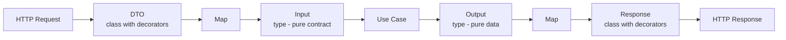
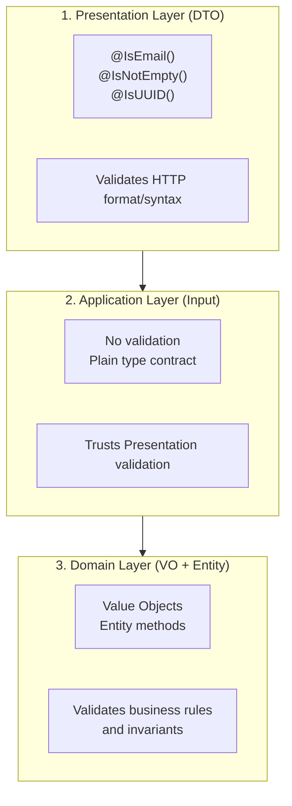
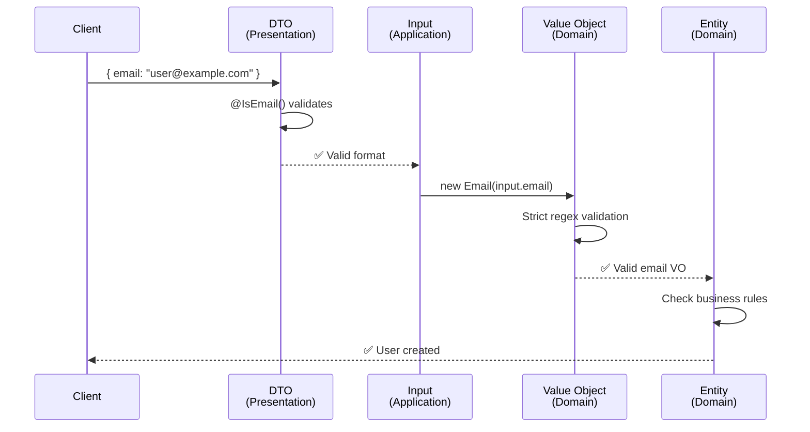
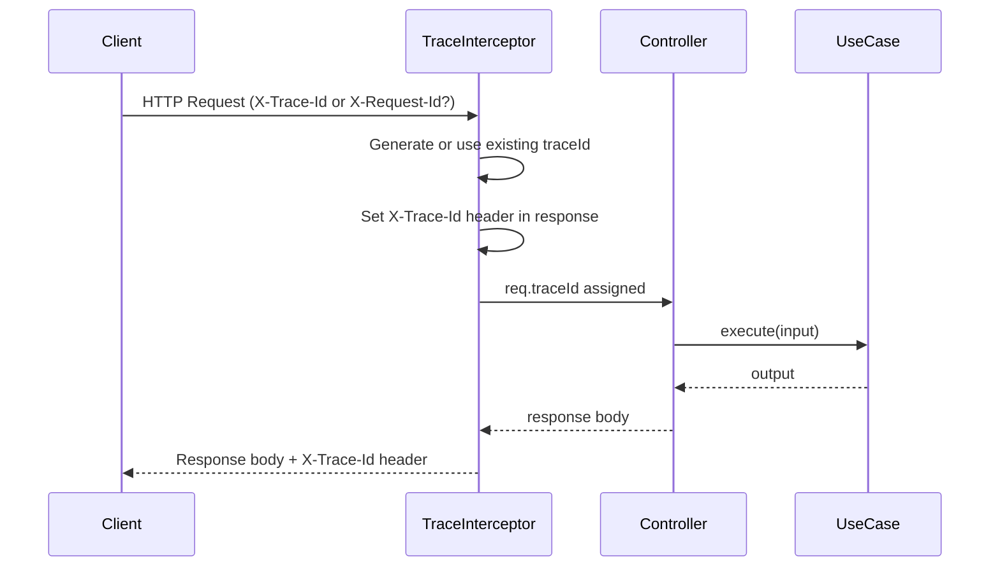

# 6. Presentation Layer - Controllers, DTOs & HTTP

> Part of the [Hexagonal & DDD in NestJS Implementation Guide](../NESTJS_DDD_COOKBOOK.md)

The Presentation Layer handles HTTP requests/responses and maps between DTOs and Application Layer contracts.

## DTO vs Input vs Output Pattern

This pattern ensures **clean separation** between Presentation and Application layers.



## Complete Controller Example

### 1. Request DTO (Presentation Layer)

```typescript
// presentation/http/dtos/create-user.request.dto.ts
import { ApiProperty } from '@nestjs/swagger';
import { IsEmail, IsNotEmpty, IsBoolean, IsOptional } from 'class-validator';

export class CreateUserDto {
  @ApiProperty({ example: 'user@example.com' })
  @IsEmail()
  @IsNotEmpty()
  email: string;

  @ApiProperty({ required: false, default: false })
  @IsBoolean()
  @IsOptional()
  emailVerified?: boolean;
}
```

### 2. Use Case Input (Application Layer)

```typescript
// application/use-cases/create-user/create-user.input.ts
export type CreateUserInput = {
  email: string;
  emailVerified?: boolean;
  blocked?: boolean;
};
```

### 3. Use Case Output (Application Layer)

```typescript
// application/use-cases/create-user/create-user.output.ts
export type CreateUserOutput = {
  id: string;
  email: string;
  emailVerified: boolean;
  createdAt: Date;
};
```

### 4. Response DTO (Presentation Layer)

```typescript
// presentation/http/dtos/user.response.dto.ts
import { ApiProperty } from '@nestjs/swagger';

export class UserResponse {
  @ApiProperty()
  id: string;

  @ApiProperty()
  email: string;

  @ApiProperty()
  emailVerified: boolean;

  @ApiProperty({ type: String })
  createdAt: string;

  constructor(output: CreateUserOutput) {
    this.id = output.id;
    this.email = output.email;
    this.emailVerified = output.emailVerified;
    this.createdAt = output.createdAt.toISOString(); // Transform Date → string
  }
}
```

### 5. Controller (Orchestration + Mapping)

```typescript
// presentation/http/controllers/user.controller.ts
import { Controller, Post, Body } from '@nestjs/common';
import { ApiResponse, ApiOperation } from '@nestjs/swagger';

@Controller('users')
export class UserController {
  constructor(private readonly createUser: CreateUserUseCase) {}

  @Post()
  @ApiOperation({ summary: 'Create a new user' })
  @ApiResponse({ status: 201, type: UserResponse })
  async create(@Body() dto: CreateUserDto): Promise<UserResponse> {
    // Map: DTO → Input
    const input: CreateUserInput = {
      email: dto.email,
      emailVerified: dto.emailVerified,
    };

    // Execute use case
    const output = await this.createUser.execute(input);

    // Map: Output → Response
    return new UserResponse(output);
  }
}
```

## Why This Pattern?

| Aspect             | Reason                                            |
| ------------------ | ------------------------------------------------- |
| **DTO ≠ Input**    | DTO has HTTP decorators; Input is pure            |
| **Composition**    | Input can combine body + query + params + headers |
| **Transformation** | Response can transform data (Date → string)       |
| **Swagger**        | Only DTO/Response have @ApiProperty               |
| **Testing**        | Use Cases don't depend on HTTP/NestJS             |

## Composing Input from Multiple Sources

```typescript
@Post()
async create(
  @Body() dto: CreateUserDto,
  @Query('source') source: string,
  @Headers('x-tenant-id') tenantId: string,
  @Req() req: Request,
): Promise<UserResponse> {
  // Compose Input from multiple sources
  const input: CreateUserInput = {
    email: dto.email, // From body
    emailVerified: dto.emailVerified,
    source: source, // From query
    tenantId: tenantId, // From header
    traceId: req.traceId, // From request
  };

  const output = await this.createUser.execute(input);
  return new UserResponse(output);
}
```

---

## Validation Strategy

Validation happens in **three layers**, each with specific responsibilities:



### Responsibility Table

| Layer            | Type             | Validates           | Example                       | Why                   |
| ---------------- | ---------------- | ------------------- | ----------------------------- | --------------------- |
| **Presentation** | `class` (DTO)    | HTTP format/syntax  | `@IsEmail()`, `@MinLength(8)` | First line of defense |
| **Application**  | `type` (Input)   | ❌ Nothing          | Plain contract                | Trusts Presentation   |
| **Domain**       | `class` (VO)     | Format + Invariants | Email regex, age > 0          | Final validation      |
| **Domain**       | `class` (Entity) | Business rules      | No duplicate email            | Enforces rules        |

### Complete Validation Flow

```typescript
// 1. PRESENTATION: DTO validates HTTP (class-validator)
export class CreateUserDto {
  @IsEmail() // ✅ Validates basic email format
  @IsNotEmpty() // ✅ Ensures not empty
  email: string;
}

// 2. APPLICATION: Input trusts DTO (no validation)
export type CreateUserInput = {
  email: string; // No validation - plain contract
};

// 3. DOMAIN: Value Object validates strictly
export class Email {
  private readonly value: string;

  constructor(value: string) {
    if (!this.isValid(value)) {
      throw new InvalidEmailError(value); // ✅ Validates AGAIN (stricter)
    }
    this.value = value.toLowerCase();
  }

  private isValid(email: string): boolean {
    // Stricter validation than DTO
    const regex = /^[a-zA-Z0-9._%+-]+@[a-zA-Z0-9.-]+\.[a-zA-Z]{2,}$/;
    return regex.test(email) && email.length <= 254;
  }
}

// 4. DOMAIN: Entity validates business rules
export class User {
  changeEmail(newEmail: Email): void {
    if (this.email.equals(newEmail)) {
      throw new EmailNotChangedException(); // ✅ Business rule
    }
    // ...
  }
}

// 5. USE CASE: Orchestrates validations
@Injectable()
export class CreateUserUseCase {
  async execute(input: CreateUserInput): Promise<CreateUserOutput> {
    // Input already validated by DTO
    const email = new Email(input.email); // ✅ VO validates again

    // Check business rule
    const existing = await this.userStorage.findByEmail(email);
    if (existing) {
      throw new UserAlreadyExistsError(); // ✅ Business rule
    }

    const user = User.create(email); // ✅ Entity validates invariants
    await this.userStorage.save(user);

    return {
      id: user.getId().toString(),
      email: user.getEmail().toString(),
      createdAt: user.getCreatedAt(),
    };
  }
}
```

### Defense in Depth



**Why multiple validations?**

1. **DTO (Presentation)**: Fast fail for invalid HTTP requests
2. **Input (Application)**: Trusts Presentation (performance)
3. **VO (Domain)**: Guarantees invariants even if called from non-HTTP sources (events, CLI, tests)
4. **Entity (Domain)**: Enforces business rules

### Key Principles

1. ✅ **DTO validates format** - First line of defense (HTTP layer)
2. ✅ **Input trusts DTO** - Avoids duplication in Application layer
3. ✅ **VO validates strictly** - Protects Domain integrity
4. ✅ **Entity validates rules** - Enforces business invariants
5. ✅ **Never skip Domain validation** - Even if DTO validated

---

## Response Envelope Pattern

**Pattern**: Consistent response structure across all endpoints.

**Recommended Structure:**

```typescript
interface HttpResponse<T> {
  data: T;
  meta?: Record<string, unknown>;
}
```

**Note**: The `meta` field content varies by project needs. Common fields include:

- `traceId` / `requestId`: For request correlation
- `timestamp`: Response generation time
- `pagination`: Page info (page, limit, total, hasNext, cursor)
- `version`: API version
- Custom fields as needed

### Example Implementation

```typescript
// shared-kernel/presentation/http/http-response.interface.ts
interface HttpResponse<T> {
  data: T;
  meta?: {
    traceId?: string;
    timestamp?: string;
    pagination?: {
      page?: number;
      limit?: number;
      total?: number;
      hasNext?: boolean;
      cursor?: string;
    };
  };
}
```

### Examples

**Individual resource**:

```json
{
  "data": {
    "id": "user_123",
    "email": "john@example.com",
    "status": "active"
  },
  "meta": {
    "traceId": "abc-def-123",
    "timestamp": "2024-01-15T10:30:00Z"
  }
}
```

**Paginated collection (cursor)**:

```json
{
  "data": [
    { "id": "user_1", "email": "user1@example.com" },
    { "id": "user_2", "email": "user2@example.com" }
  ],
  "meta": {
    "traceId": "abc-def-456",
    "limit": 20,
    "hasNext": true,
    "cursor": "eyJpZCI6InVzZXJfMiJ9"
  }
}
```

**Paginated collection (offset)**:

```json
{
  "data": [{ "id": "user_1", "email": "user1@example.com" }],
  "meta": {
    "traceId": "abc-def-789",
    "page": 1,
    "limit": 20,
    "total": 150,
    "hasNext": true
  }
}
```

---

## TraceId Generation & Correlation

It's recommended to generate a `traceId` per HTTP request and propagate it to logs and responses.

### Correlation Interceptor

```typescript
// shared-kernel/presentation/http/interceptors/trace.interceptor.ts
import {
  CallHandler,
  ExecutionContext,
  Injectable,
  NestInterceptor,
} from '@nestjs/common';
import { Observable } from 'rxjs';
import { randomUUID } from 'crypto';

export const TRACE_ID_HEADER = 'x-trace-id';

@Injectable()
export class TraceInterceptor implements NestInterceptor {
  intercept(ctx: ExecutionContext, next: CallHandler): Observable<any> {
    const req = ctx.switchToHttp().getRequest();
    const res = ctx.switchToHttp().getResponse();
    const traceId =
      req.headers['x-trace-id'] ||
      req.headers['x-request-id'] ||
      req.id ||
      randomUUID();

    res.setHeader('X-Trace-Id', traceId);
    req.traceId = traceId;

    return next.handle();
  }
}
```

### TypeScript Declaration

```typescript
// types/express.d.ts
import 'express';

declare module 'express-serve-static-core' {
  interface Request {
    traceId?: string;
  }
}
```

### Global Registration

```typescript
// main.ts
import { TraceInterceptor } from '@shared-kernel/presentation/http/interceptors/trace.interceptor';

async function bootstrap() {
  const app = await NestFactory.create(AppModule);
  app.useGlobalInterceptors(new TraceInterceptor());
  await app.listen(3000);
}
```

### Key Behaviors

**TraceId transmission:**

- The `traceId` is transmitted via HTTP header `X-Trace-Id`
- Supports multiple header sources: `x-trace-id`, `x-request-id`, or generates new UUID v4
- The traceId is **NOT included in response body**, only in headers
- This approach keeps response bodies clean and allows file downloads (StreamableFile) to work correctly

**Why headers instead of body:**

- ✅ Compatible with binary responses (files, images, PDFs)
- ✅ Standard HTTP practice for correlation IDs
- ✅ Doesn't pollute business response structure
- ✅ Accessible in all HTTP clients and proxies
- ✅ Can be logged without parsing response body

### Usage in Controllers

```typescript
import { Req } from '@nestjs/common';
import { Request } from 'express';

@Post()
async create(@Body() body: CreateUserDto, @Req() req: Request) {
  this.logger.log({ traceId: req.traceId, action: 'create_user' });
  const result = await this.createUser.execute(body);
  return new UserResponse(result);
}
```

### Flow Diagram



### Best Practices

- Propagate `traceId` in logs at all layers (presentation, application, infrastructure) for correlation
- In async tasks (messaging), propagate `traceId` in message headers
- The interceptor automatically handles all response types including StreamableFile
- Clients should read `X-Trace-Id` from response headers for request tracking
- Use the same traceId when logging errors for easier troubleshooting

---

## Exception Handling

Use a global exception filter to map domain exceptions to HTTP responses:

```typescript
// presentation/http/filters/domain-exception.filter.ts
import {
  ExceptionFilter,
  Catch,
  ArgumentsHost,
  HttpStatus,
} from '@nestjs/common';
import { DomainException } from '@shared-kernel/domain/exceptions/domain.exception';

@Catch(DomainException)
export class DomainExceptionFilter implements ExceptionFilter {
  catch(exception: DomainException, host: ArgumentsHost) {
    const ctx = host.switchToHttp();
    const response = ctx.getResponse();
    const request = ctx.getRequest();

    const statusCode = this.mapExceptionToStatus(exception);

    response.status(statusCode).json({
      error: {
        code: exception.code,
        message: exception.message,
        details: exception.details,
      },
      meta: {
        traceId: request.traceId,
        timestamp: new Date().toISOString(),
        path: request.url,
      },
    });
  }

  private mapExceptionToStatus(exception: DomainException): number {
    const mapping: Record<string, number> = {
      NOT_FOUND: HttpStatus.NOT_FOUND,
      ALREADY_EXISTS: HttpStatus.CONFLICT,
      INVALID_INPUT: HttpStatus.BAD_REQUEST,
      UNAUTHORIZED: HttpStatus.UNAUTHORIZED,
      FORBIDDEN: HttpStatus.FORBIDDEN,
    };

    return mapping[exception.code] || HttpStatus.INTERNAL_SERVER_ERROR;
  }
}
```

---

**Navigation:** [Previous: Infrastructure Layer](./05-infrastructure-layer.md) | [Up](../NESTJS_DDD_COOKBOOK.md) | [Next: Shared Kernel](./07-shared-kernel.md)
