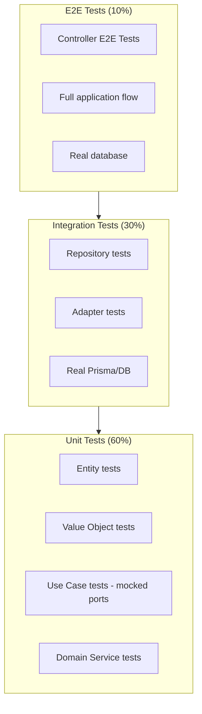

# 8. Testing Strategy

> Part of the [Hexagonal & DDD in NestJS Implementation Guide](../NESTJS_DDD_COOKBOOK.md)

For comprehensive testing guidelines, see [TESTING_STRATEGY.md](../../guidelines/TESTING_STRATEGY.md).

## Testing Pyramid



## Testing by Layer

| Layer            | Test Type   | Dependencies      | Focus                          |
| ---------------- | ----------- | ----------------- | ------------------------------ |
| **Domain**       | Unit        | None              | Business logic, invariants     |
| **Application**  | Unit        | Mock ports        | Orchestration logic            |
| **Infrastructure** | Integration | Real DB/APIs      | Persistence, external calls    |
| **Presentation** | E2E         | Full app          | HTTP flow, validation          |

## Domain Layer Testing (Unit)

### Value Object Tests

```typescript
// domain/value-objects/email.vo.spec.ts
describe('Email', () => {
  it('should create valid email', () => {
    const email = new Email('user@example.com');
    expect(email.toString()).toBe('user@example.com');
  });

  it('should throw on invalid email', () => {
    expect(() => new Email('invalid')).toThrow(InvalidEmailError);
  });

  it('should compare emails correctly', () => {
    const email1 = new Email('USER@example.com');
    const email2 = new Email('user@example.com');
    expect(email1.equals(email2)).toBe(true);
  });
});
```

### Entity Tests

```typescript
// domain/entities/user.entity.spec.ts
describe('User', () => {
  it('should create user and record event', () => {
    const user = User.create('id-123', new Email('user@example.com'));

    expect(user.getId()).toBe('id-123');
    const events = user.pullEvents();
    expect(events).toHaveLength(1);
    expect(events[0]).toBeInstanceOf(UserCreatedEvent);
  });

  it('should change email when active', () => {
    const user = User.reconstitute('id-123', 'old@example.com', 'active');
    const newEmail = new Email('new@example.com');

    user.changeEmail(newEmail);

    expect(user.getEmail().equals(newEmail)).toBe(true);
    const events = user.pullEvents();
    expect(events[0]).toBeInstanceOf(UserEmailChangedEvent);
  });

  it('should not change email when suspended', () => {
    const user = User.reconstitute('id-123', 'old@example.com', 'suspended');

    expect(() => {
      user.changeEmail(new Email('new@example.com'));
    }).toThrow(UserNotActiveError);
  });
});
```

## Application Layer Testing (Unit)

### Use Case Tests with Mocked Ports

```typescript
// application/use-cases/create-user/create-user.use-case.spec.ts
import { Test } from '@nestjs/testing';
import { CreateUserUseCase } from './create-user.use-case';
import { FOR_STORING_USERS } from '../../ports/output/for-storing-users.port';

describe('CreateUserUseCase', () => {
  let useCase: CreateUserUseCase;
  let mockStorage: any;

  beforeEach(async () => {
    mockStorage = {
      save: jest.fn(),
      findByEmail: jest.fn(),
    };

    const module = await Test.createTestingModule({
      providers: [
        CreateUserUseCase,
        { provide: FOR_STORING_USERS, useValue: mockStorage },
      ],
    }).compile();

    useCase = module.get(CreateUserUseCase);
  });

  it('should create user when email is unique', async () => {
    mockStorage.findByEmail.mockResolvedValue(null);

    const result = await useCase.execute({
      id: 'uuid-123',
      email: 'john@example.com',
    });

    expect(result.email).toBe('john@example.com');
    expect(mockStorage.save).toHaveBeenCalledTimes(1);
  });

  it('should throw when email already exists', async () => {
    mockStorage.findByEmail.mockResolvedValue({});

    await expect(
      useCase.execute({ id: 'uuid-123', email: 'john@example.com' }),
    ).rejects.toThrow(UserAlreadyExistsException);
  });
});
```

## Infrastructure Layer Testing (Integration)

### Repository Integration Tests

```typescript
// infrastructure/adapters/persistence/prisma-user.repository.spec.ts
import { Test } from '@nestjs/testing';
import { PrismaService } from '@shared-kernel/infrastructure/adapters/persistence/prisma.service';
import { PrismaUserRepository } from './prisma-user.repository';
import { User } from '../../../domain/entities/user.entity';
import { Email } from '@shared-kernel/domain/value-objects/email.vo';

describe('PrismaUserRepository (Integration)', () => {
  let repository: PrismaUserRepository;
  let prisma: PrismaService;

  beforeAll(async () => {
    const module = await Test.createTestingModule({
      providers: [
        PrismaUserRepository,
        PrismaService,
        { provide: EVENT_BUS, useValue: { publish: jest.fn() } },
      ],
    }).compile();

    repository = module.get(PrismaUserRepository);
    prisma = module.get(PrismaService);
  });

  afterEach(async () => {
    await prisma.user.deleteMany();
  });

  it('should save and find user by email', async () => {
    const user = User.create('id-123', new Email('test@example.com'));
    await repository.save(user);

    const found = await repository.findByEmail(new Email('test@example.com'));

    expect(found).toBeDefined();
    expect(found.getId()).toBe('id-123');
  });

  it('should return null when user not found', async () => {
    const found = await repository.findByEmail(
      new Email('notfound@example.com'),
    );

    expect(found).toBeNull();
  });
});
```

## Presentation Layer Testing (E2E)

### Controller E2E Tests

```typescript
// presentation/http/controllers/user.controller.spec.ts (E2E)
import { Test } from '@nestjs/testing';
import { INestApplication } from '@nestjs/common';
import * as request from 'supertest';
import { AppModule } from '../../../app.module';

describe('UserController (E2E)', () => {
  let app: INestApplication;

  beforeAll(async () => {
    const moduleRef = await Test.createTestingModule({
      imports: [AppModule],
    }).compile();

    app = moduleRef.createNestApplication();
    await app.init();
  });

  afterAll(async () => {
    await app.close();
  });

  it('POST /users - should create user', () => {
    return request(app.getHttpServer())
      .post('/users')
      .send({ email: 'test@example.com' })
      .expect(201)
      .expect((res) => {
        expect(res.body.data.email).toBe('test@example.com');
        expect(res.body.data.id).toBeDefined();
      });
  });

  it('POST /users - should return 400 for invalid email', () => {
    return request(app.getHttpServer())
      .post('/users')
      .send({ email: 'invalid' })
      .expect(400);
  });
});
```

## Testing Best Practices

1. ✅ **Test business logic** in domain layer (entities, VOs)
2. ✅ **Mock ports** in use case tests
3. ✅ **Use real database** for repository tests
4. ✅ **Test full flow** in E2E tests
5. ✅ **Test edge cases** and error scenarios
6. ❌ **Don't test framework code** (NestJS internals)
7. ❌ **Don't test DTOs** (class-validator does it)

---

**Navigation:** [Previous: Shared Kernel](./07-shared-kernel.md) | [Up](../NESTJS_DDD_COOKBOOK.md) | [Next: Recipes](./09-recipes.md)
