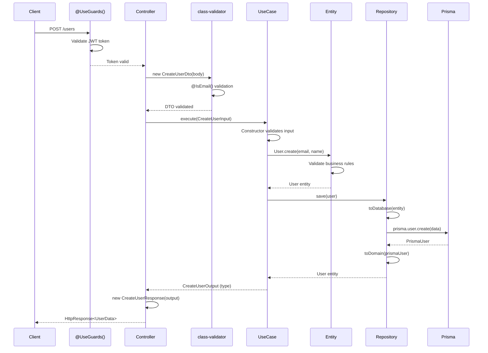
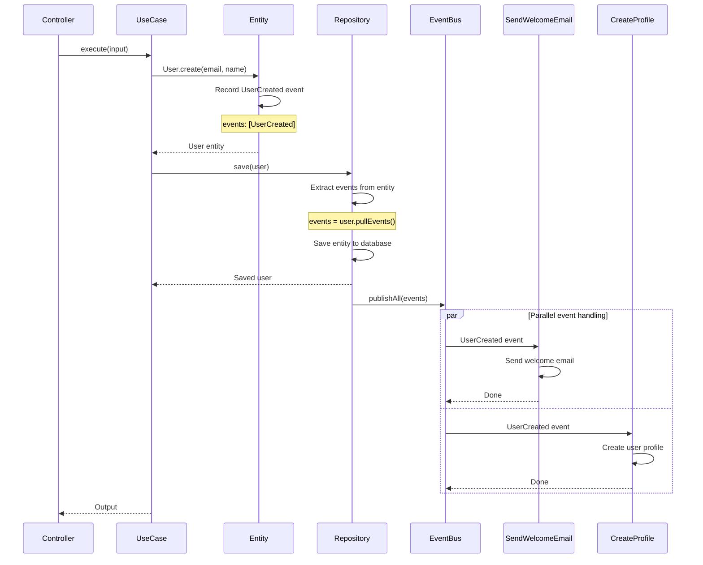
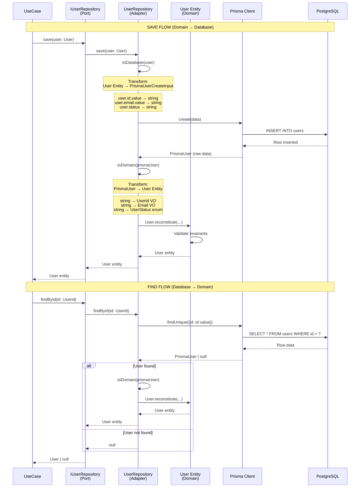
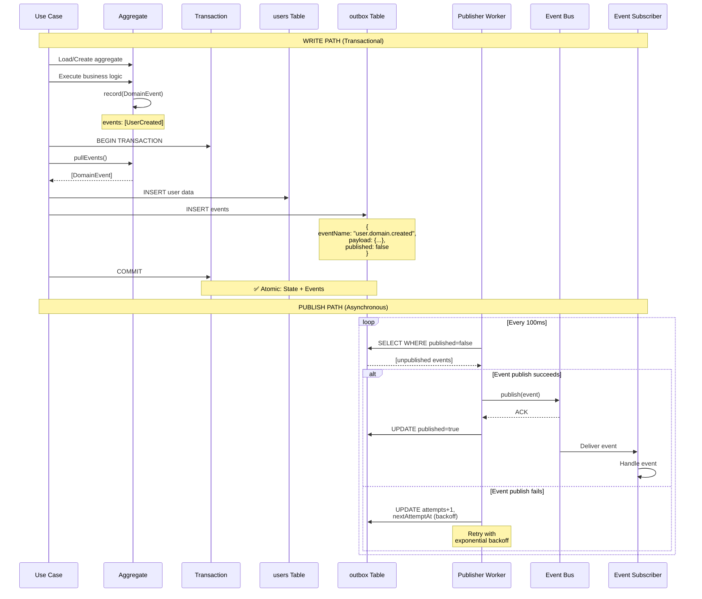
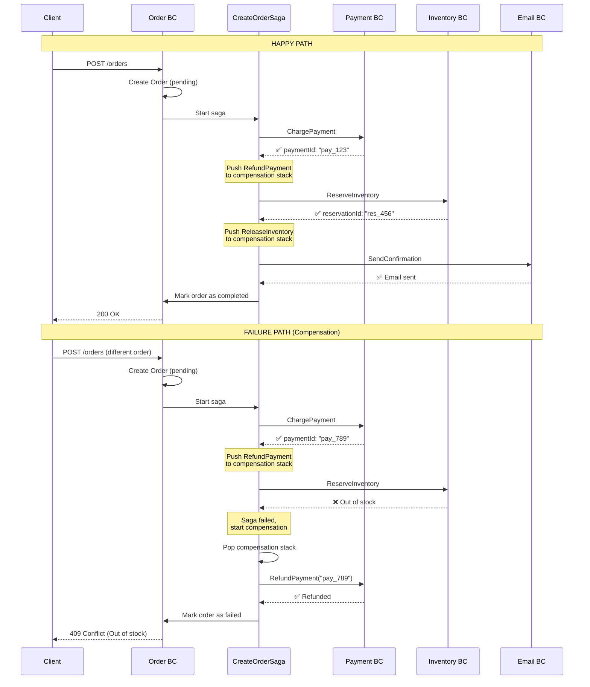
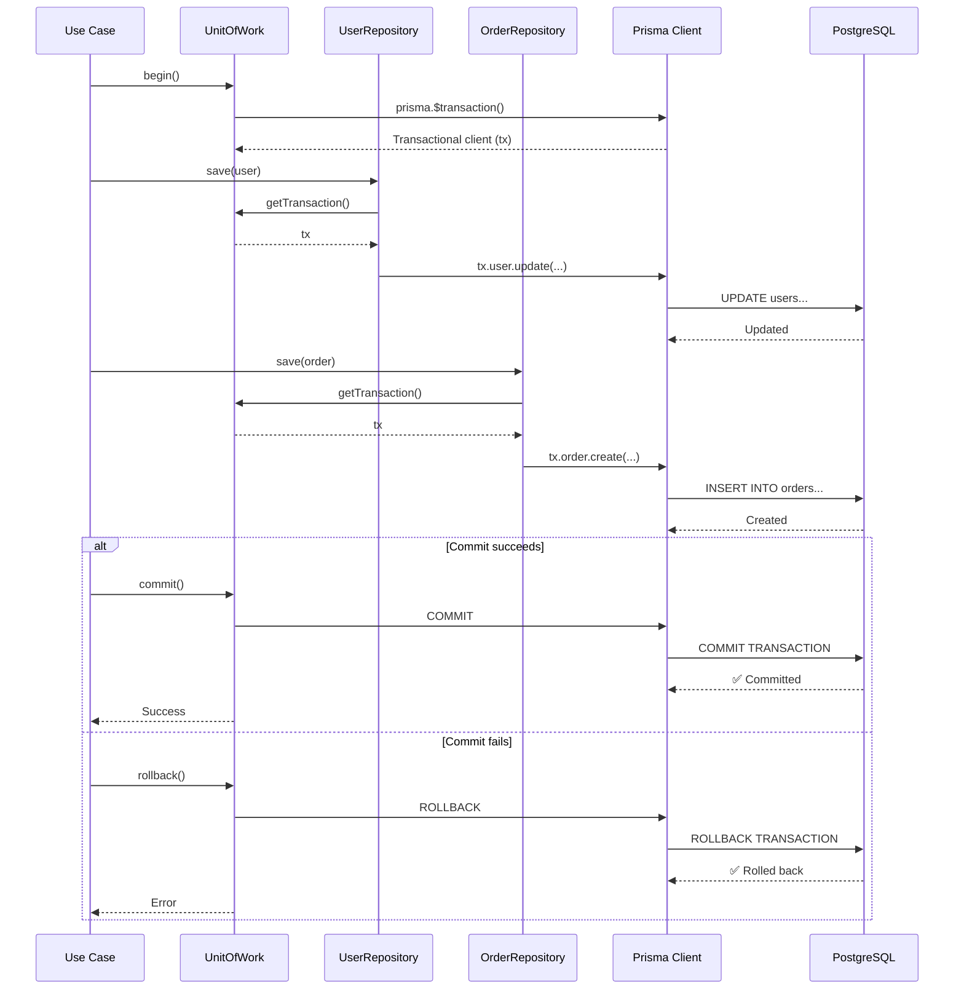
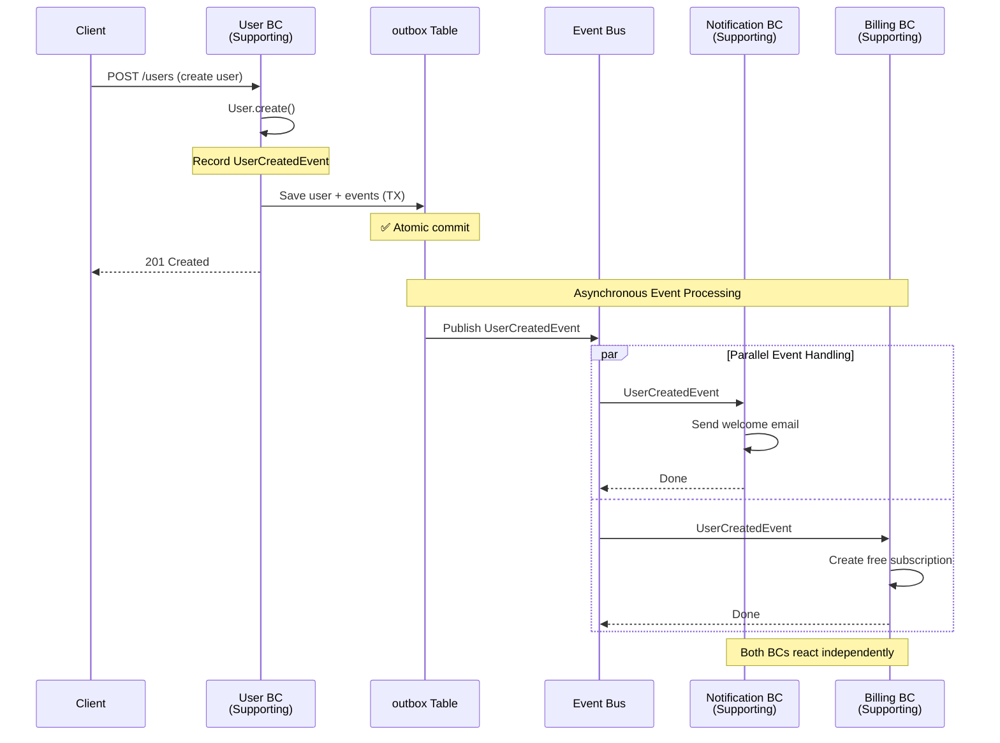

# Execution Flow Diagrams

> Visual representations of complete request flows through hexagonal architecture layers

This section provides comprehensive sequence diagrams showing how different components interact during typical operations in a hexagonal architecture with NestJS.

---

## 10.1 HTTP Request Complete Flow

This diagram shows the complete journey of an HTTP request through all hexagonal layers with NestJS tools:



**Key NestJS tools in action**:

- `@UseGuards()`: Authentication/authorization before controller
- `class-validator`: DTO validation (`@IsEmail()`, `@IsString()`)
- Dependency injection: `@Inject(USER_REPOSITORY)`
- Response transformation: `HttpResponse<T>` wrapper

---

## 10.2 Use Case with Domain Events Flow

This diagram shows how domain events are recorded during use case execution and published after successful persistence:



**Critical flow details**:

1. **Event Recording**: Entity records events internally during business operations
2. **Event Extraction**: Repository calls `entity.pullEvents()` before saving
3. **Transactional Safety**: Events published AFTER successful database save
4. **Parallel Handlers**: Multiple handlers process the same event independently

**NestJS implementation**:

```typescript
// Repository extracts and publishes events
async save(user: User): Promise<User> {
  const events = user.pullEvents(); // Extract before save
  const saved = await this.prisma.user.create(...);
  await this.eventBus.publishAll(events); // Publish after save
  return this.toDomain(saved);
}
```

---

## 10.3 Repository Entity Mapping Flow

This diagram shows the bidirectional transformation between Domain Entities and Prisma models:



**Transformation responsibilities**:

**`toDatabase(entity: User)`** - Domain → Persistence:

```typescript
private toDatabase(user: User): Prisma.UserCreateInput {
  return {
    id: user.id.value,              // UserId VO → string
    email: user.email.value,        // Email VO → string
    name: user.name,                // string → string
    status: user.status,            // UserStatus enum → string
    createdAt: user.createdAt,      // Date → Date
  };
}
```

**`toDomain(prismaUser: PrismaUser)`** - Persistence → Domain:

```typescript
private toDomain(data: PrismaUser): User {
  return User.reconstitute({
    id: new UserId(data.id),             // string → UserId VO
    email: new Email(data.email),        // string → Email VO
    name: data.name,                     // string → string
    status: data.status as UserStatus,   // string → enum
    createdAt: data.createdAt,           // Date → Date
  });
}
```

**Key principles**:

1. **Port (Interface)**: Works only with domain types (`User`, `UserId`)
2. **Adapter (Repository)**: Handles all transformations and Prisma interaction
3. **Entity Reconstitution**: `User.reconstitute()` bypasses constructor validation for existing data
4. **Value Object Unwrapping**: Always use `.value` to extract primitive from VO
5. **Null Safety**: Handle `null` results from Prisma appropriately

---

## 10.4 Outbox Pattern Flow

This diagram shows the complete flow of the Outbox pattern for reliable event publishing:



**Key guarantees:**
1. **Atomicity**: User state and events committed together (same TX)
2. **Durability**: Events persisted before publishing
3. **Reliability**: Worker retries failed publishes with backoff
4. **Ordering**: Events published in occurrence order (ORDER BY occurredAt)

---

## 10.5 Saga Orchestration Flow (with Compensation)

This diagram shows a Saga handling a multi-bounded-context transaction with failure compensation:



**Key principles:**
1. **Compensation Stack**: Each successful step pushes compensation to stack (LIFO)
2. **Forward Recovery**: Try to complete; if fail, compensate in reverse order
3. **Idempotency**: Compensations must be idempotent (can be called multiple times)
4. **Eventual Consistency**: Order may temporarily be in "pending" state

**Saga State Transitions:**
```
PENDING → IN_PROGRESS → COMPLETED (happy path)
                      → COMPENSATING → FAILED (error path)
```

---

## 10.6 UnitOfWork Pattern Flow

This diagram shows how UnitOfWork coordinates multiple repository operations in a single transaction:



**Key benefits:**
1. **Single Transaction**: Multiple repositories share the same DB transaction
2. **Consistency**: All-or-nothing commit across multiple aggregates
3. **Performance**: Batch operations in single roundtrip

**Code example:**
```typescript
async execute(input: CreateOrderInput) {
  await this.unitOfWork.begin();

  try {
    const user = await this.userRepo.findById(input.userId);
    user.incrementOrderCount();
    await this.userRepo.save(user);

    const order = Order.create(input);
    await this.orderRepo.save(order);

    await this.unitOfWork.commit();
  } catch (error) {
    await this.unitOfWork.rollback();
    throw error;
  }
}
```

---

## 10.7 Cross-BC Communication Flow (Event-Driven)

This diagram shows how bounded contexts communicate asynchronously via domain events:



**Key characteristics:**
1. **Decoupling**: User BC doesn't know about Notification/Billing BCs
2. **Async**: Event handling doesn't block user creation response
3. **Independence**: Each BC processes events at its own pace
4. **Scalability**: Multiple subscribers can handle same event

---

## Navigation

[← Previous: Common Pitfalls](11-common-pitfalls.md) | [Index](README.md) | [Next: Domain Services & Use Cases](13-domain-services-and-use-cases.md)
