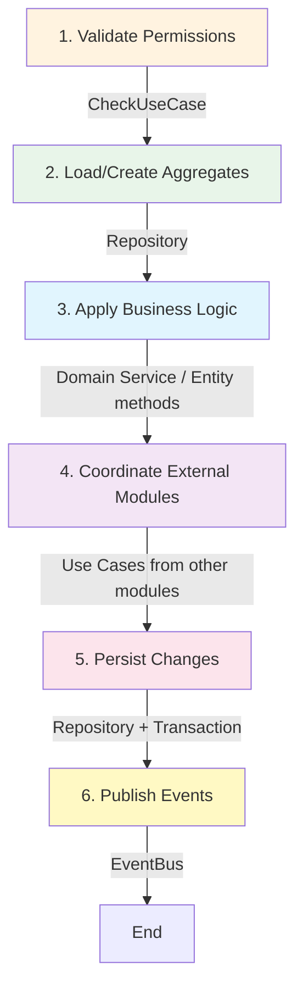
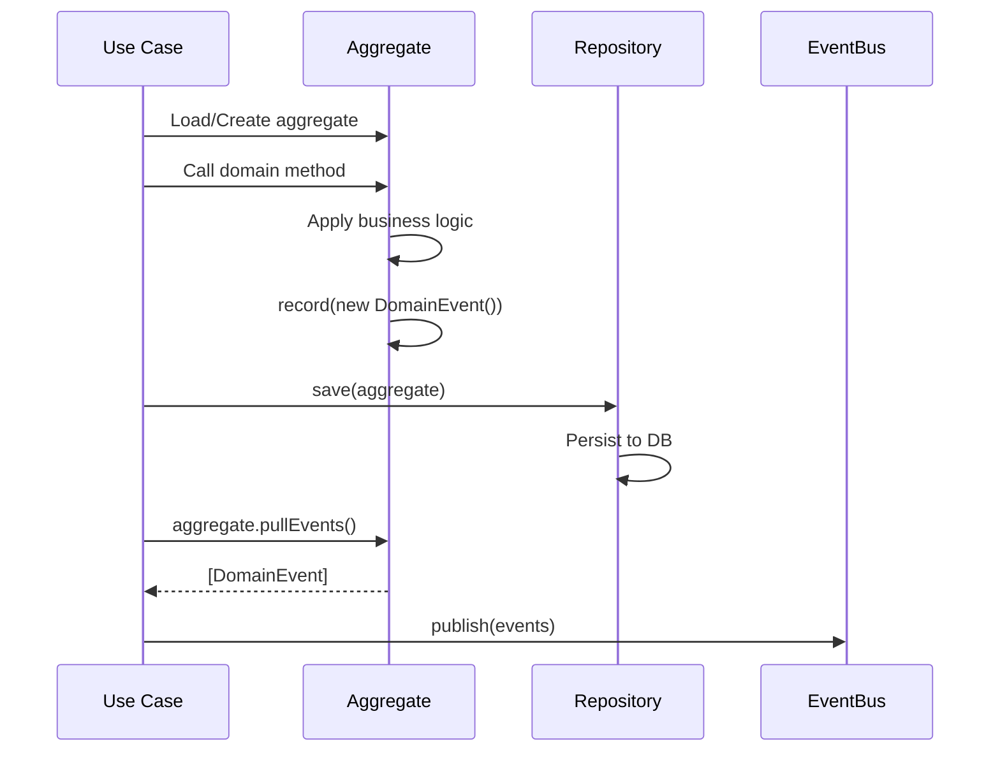
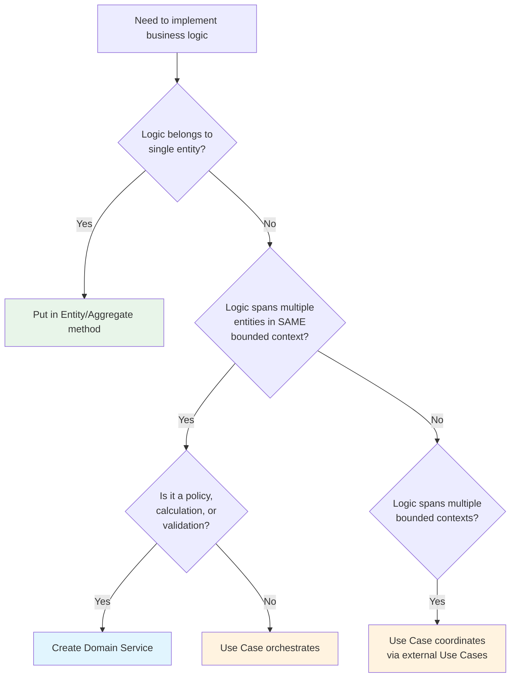

# 13. Domain Services and Use Cases - Orchestration Patterns

> Part of the [Hexagonal & DDD in NestJS Implementation Guide](../NESTJS_DDD_COOKBOOK.md)

This guide clarifies the **critical difference** between Domain Services and Use Cases (Application Services), one of the most confusing aspects of DDD implementation.

## TL;DR - Quick Reference

| Aspect | Domain Service | Use Case (Application Service) |
|--------|---------------|-------------------------------|
| **Purpose** | Pure business logic | Orchestration & coordination |
| **Location** | `domain/services/` | `application/use-cases/` |
| **Depends on** | Entities, VOs, Repository Interfaces | Everything (domain + external) |
| **Can call** | Domain objects only | Use Cases from other modules |
| **Handles** | Business rules & policies | Transactions, events, permissions |
| **Emits events** | NO (Aggregates do) | YES (publishes aggregate events) |
| **NestJS** | `@Injectable()` | `@Injectable()` |
| **Example** | `DiscountPolicyService` | `CreateOrderUseCase` |

---

## The Confusion

Many developers create "Domain Services" that are actually **Application Services doing orchestration**. This breaks DDD principles and makes code harder to maintain.

### ❌ Common Mistake

```typescript
// ❌ BAD - This is NOT a Domain Service, it's an Application Service
// It orchestrates, handles transactions, calls external modules
@Injectable()
export class OrganizationCreationService {
  constructor(
    private readonly prisma: PrismaService,
    private readonly createBucketUseCase: CreateBucketUseCase, // External!
    private readonly createAuthContextUseCase: CreateAuthContextUseCase, // External!
  ) {}

  async createOrganization(data) {
    return this.prisma.$transaction(async () => { // Transaction!
      const org = await this.prisma.organization.create(...); // Persistence!
      await this.createBucketUseCase.execute(...); // Coordination!
      await this.createAuthContextUseCase.execute(...); // Coordination!
    });
  }
}
```

**Why this is wrong:**
- Handles transactions (application concern)
- Coordinates with external modules (application concern)
- Direct database persistence (should use repository interfaces)

---

## Domain Services - Pure Business Logic

### What Are Domain Services?

Domain Services encapsulate **business logic** that:
1. **Doesn't belong to a single Entity/Aggregate**
2. **Operates on multiple domain objects** within the same bounded context
3. **Represents domain concepts** that are naturally services, not things

### When to Use Domain Services

Use Domain Services **only when** you have:

#### ✅ 1. Business Policies

```typescript
// domain/services/membership-policy.service.ts
@Injectable()
export class MembershipPolicyService {
  canAddMember(
    organization: Organization,
    newMemberId: string,
    currentMemberCount: number,
  ): boolean {
    // Business Rule: Free plan has 5 member limit
    if (organization.isPlanFree() && currentMemberCount >= 5) {
      return false;
    }

    // Business Rule: User can't be member of competitor org
    if (this.isCompetitor(organization, newMemberId)) {
      return false;
    }

    return true;
  }

  private isCompetitor(org: Organization, userId: string): boolean {
    // Pure domain logic
  }
}
```

#### ✅ 2. Complex Calculations Between Entities

```typescript
// domain/services/discount-calculator.service.ts
@Injectable()
export class DiscountCalculatorService {
  calculateFor(customer: Customer, cart: Cart): Discount {
    // Business logic: volume discounts, loyalty points, promotions
    const baseDiscount = this.calculateVolumeDiscount(cart);
    const loyaltyBonus = this.calculateLoyaltyBonus(customer);
    return new Discount(baseDiscount + loyaltyBonus);
  }
}
```

#### ✅ 3. Cross-Aggregate Validations

```typescript
// domain/services/booking-validation.service.ts
@Injectable()
export class BookingValidationService {
  canBook(room: Room, guest: Guest, dateRange: DateRange): boolean {
    // Business rules involving multiple aggregates
    if (!room.isAvailable(dateRange)) return false;
    if (guest.hasActiveBooking(dateRange)) return false;
    if (room.requiresVipAccess() && !guest.isVip()) return false;
    return true;
  }
}
```

#### ✅ 4. Money Transfers Between Accounts

```typescript
// domain/services/transfer.service.ts
@Injectable()
export class TransferService {
  transfer(from: Account, to: Account, amount: Money): void {
    // Business invariants
    if (!from.canWithdraw(amount)) {
      throw new InsufficientFundsError();
    }

    from.withdraw(amount);
    to.deposit(amount);

    // Both aggregates record events
    // Use Case will publish them
  }
}
```

### What Domain Services DON'T Do

❌ **Orchestrate use cases** (that's Application Service responsibility)
❌ **Handle transactions** (that's Application Service responsibility)
❌ **Coordinate with other bounded contexts** (that's Application Service responsibility)
❌ **Publish events to EventBus** (that's Application Service responsibility)
❌ **Call use cases from other modules** (that's Application Service responsibility)

### Domain Service Structure

```typescript
// domain/services/policy-name.service.ts
import { Injectable } from '@nestjs/common';
import { Entity1 } from '../entities/entity1.entity';
import { Entity2 } from '../entities/entity2.entity';
import { ValueObject } from '../value-objects/value-object.vo';

@Injectable()
export class PolicyNameService {
  // ONLY inject repository INTERFACES (ports), never implementations
  constructor(
    @Inject(ENTITY_REPOSITORY)
    private readonly entityRepo: IEntityRepository,
  ) {}

  // Pure business logic methods
  canPerformAction(entity1: Entity1, entity2: Entity2): boolean {
    // Only domain logic
  }

  calculateSomething(vo: ValueObject): Result {
    // Only domain logic
  }
}
```

---

## Use Cases - Application Orchestrators

### What Are Use Cases?

Use Cases (Application Services) are **orchestrators** that:
1. **Coordinate domain objects** to fulfill a user action
2. **Handle cross-cutting concerns** (transactions, events, permissions)
3. **Bridge between bounded contexts** via other use cases
4. **Control the application flow**

### Use Case Responsibilities

A Use Case **ALWAYS** does these things (in order):



### Complete Use Case Example

```typescript
// application/use-cases/add-member/add-member.use-case.ts
import { Injectable, ForbiddenException } from '@nestjs/common';
import { Inject } from '@nestjs/common';
import { ExecutionContext } from '@shared-kernel/application/execution-context';
import { CheckUseCase, CheckInput } from '@supporting/iam/authz';
import { AssignRoleToUserUseCase, AssignRoleToUserInput } from '@supporting/iam/authz';
import { EVENT_BUS, EventBusPort } from '@supporting/infrastructure/event-bus';
import { PrismaService } from '@shared-kernel/infrastructure/adapters/persistence/prisma.service';
import { MembershipPolicyService } from '../../../domain/services/membership-policy.service';
import { OrganizationMemberWritePermission } from '../../../domain/permissions';
import { MemberAddedEvent } from '../../../domain/events';
import { MembershipAlreadyExistsError } from '../../../errors';

export class AddMemberInput {
  constructor(
    public readonly organizationId: string,
    public readonly userId: string,
    public readonly roleId?: string,
  ) {}
}

export type AddMemberOutput = void;

@Injectable()
export class AddMemberUseCase {
  constructor(
    // Authz
    private readonly checkUseCase: CheckUseCase,
    private readonly assignRoleUseCase: AssignRoleToUserUseCase,
    // Domain
    private readonly membershipPolicy: MembershipPolicyService,
    // Infrastructure
    private readonly prisma: PrismaService,
    @Inject(EVENT_BUS)
    private readonly eventBus: EventBusPort,
  ) {}

  async execute(
    context: ExecutionContext,
    input: AddMemberInput,
  ): Promise<AddMemberOutput> {
    // ========================================
    // 1. VALIDATE PERMISSIONS (Application)
    // ========================================
    const permissionCheck = await this.checkUseCase.execute(
      new CheckInput(
        context.userId,
        `org-${context.organizationId}`,
        new OrganizationMemberWritePermission(),
      ),
    );

    if (!permissionCheck.allowed) {
      throw new ForbiddenException('No permission to add members');
    }

    // ========================================
    // 2. LOAD AGGREGATES (Application)
    // ========================================
    const organization = await this.prisma.organization.findUnique({
      where: { id: input.organizationId },
    });

    const memberCount = await this.prisma.organizationMembership.count({
      where: { organizationId: input.organizationId },
    });

    const existingMembership = await this.prisma.organizationMembership.findUnique({
      where: {
        userId_organizationId: {
          userId: input.userId,
          organizationId: input.organizationId,
        },
      },
    });

    if (existingMembership) {
      throw new MembershipAlreadyExistsError();
    }

    // ========================================
    // 3. APPLY BUSINESS LOGIC (Domain)
    // ========================================
    // Option A: Call Domain Service (if complex policy)
    const canAdd = this.membershipPolicy.canAddMember(
      organization,
      input.userId,
      memberCount,
    );

    if (!canAdd) {
      throw new CannotAddMemberError('Member limit reached');
    }

    // Option B: Call Entity method (if simple logic)
    // organization.addMember(input.userId); // Would record event

    // ========================================
    // 4. COORDINATE WITH EXTERNAL MODULES (Application)
    // 5. PERSIST CHANGES (Application + Transaction)
    // ========================================
    await this.prisma.$transaction(async (tx) => {
      // Create membership
      await tx.organizationMembership.create({
        data: {
          userId: input.userId,
          organizationId: input.organizationId,
          status: 'active',
        },
      });

      // Coordinate with authz subdomain (if role provided)
      if (input.roleId) {
        await this.assignRoleUseCase.execute(
          new AssignRoleToUserInput(
            input.userId,
            `org-${input.organizationId}`,
            input.roleId,
          ),
        );
      }
    });

    // ========================================
    // 6. PUBLISH EVENTS (Application)
    // ========================================
    await this.eventBus.publish([
      new MemberAddedEvent(
        input.organizationId,
        input.userId,
        input.roleId,
      ),
    ]);
  }
}
```

### Key Points

1. **Use Case receives ExecutionContext + Input**
   ```typescript
   async execute(
     context: ExecutionContext,  // Who is executing
     input: AddMemberInput,       // What to execute
   ): Promise<AddMemberOutput>
   ```

2. **Use Case validates permissions**
   ```typescript
   await this.checkUseCase.execute(
     new CheckInput(context.userId, contextId, permission),
   );
   ```

3. **Use Case handles transactions**
   ```typescript
   await this.prisma.$transaction(async (tx) => {
     // All persistence here
   });
   ```

4. **Use Case coordinates between bounded contexts**
   ```typescript
   // Calling use case from authz module
   await this.assignRoleUseCase.execute(input);
   ```

5. **Use Case publishes events**
   ```typescript
   await this.eventBus.publish([event1, event2]);
   ```

---

## Domain Events - Who Emits?

### ✅ Correct Flow



### Aggregate Records Events

```typescript
// domain/entities/organization.entity.ts
export class Organization extends AggregateRoot {
  addMember(userId: string): void {
    // Business invariants
    if (this.members.includes(userId)) {
      throw new MemberAlreadyExistsError();
    }

    this.members.push(userId);

    // Record event (not publish!)
    this.record(new MemberAddedEvent(this.id, userId));
  }
}
```

### Use Case Publishes Events

```typescript
// application/use-cases/add-member.use-case.ts
async execute(context, input) {
  // Load aggregate
  const organization = await this.orgRepo.findById(input.organizationId);

  // Domain logic (aggregate records event)
  organization.addMember(input.userId);

  // Persist
  await this.orgRepo.save(organization);

  // Publish events
  const events = organization.pullEvents();
  await this.eventBus.publish(events);
}
```

### Why This Pattern?

1. **Aggregates own their state changes** → They know when events should occur
2. **Use Cases control persistence** → Events only published if transaction succeeds
3. **No event if transaction fails** → Consistency guaranteed

---

## Decision Matrix

### Should I create a Domain Service?



### Examples

| Scenario | Solution | Rationale |
|----------|----------|-----------|
| Validate email format | Value Object | Single value validation |
| User suspends their account | Entity method | Single aggregate behavior |
| Calculate discount based on customer tier + cart | Domain Service | Cross-entity business logic |
| Create order + charge payment + send email | Use Case | Orchestration across modules |
| Transfer money between accounts | Domain Service | Multi-aggregate operation with invariants |
| Check if user can book room | Domain Service | Cross-aggregate validation |

---

## Common Anti-Patterns

### ❌ Anti-Pattern 1: Domain Service Doing Orchestration

```typescript
// ❌ BAD
@Injectable()
export class OrganizationService {
  async create(data) {
    const org = await this.prisma.organization.create(...);
    await this.createBucket(...); // Coordination!
    await this.createAuthContext(...); // Coordination!
    return org;
  }
}
```

**Fix:** Make it a Use Case, not a Domain Service.

### ❌ Anti-Pattern 2: Use Case With No Orchestration

```typescript
// ❌ BAD - This should be a simple service method
@Injectable()
export class GetOrganizationByIdUseCase {
  async execute(id: string) {
    return this.prisma.organization.findUnique({ where: { id } });
  }
}
```

**Fix:** Simple CRUD doesn't need Use Cases. Use a plain service.

### ❌ Anti-Pattern 3: Domain Service Calling External Use Cases

```typescript
// ❌ BAD
@Injectable()
export class MembershipService {
  constructor(
    private readonly assignRoleUseCase: AssignRoleToUserUseCase, // External!
  ) {}

  async addMember(data) {
    // ...
    await this.assignRoleUseCase.execute(...); // Domain Service calling external!
  }
}
```

**Fix:** Move to Use Case. Domain Services stay within bounded context.

### ❌ Anti-Pattern 4: Publishing Events from Domain Service

```typescript
// ❌ BAD
@Injectable()
export class PolicyService {
  constructor(
    private readonly eventBus: EventBus, // Infrastructure!
  ) {}

  calculateDiscount(cart) {
    const discount = ...;
    await this.eventBus.publish(new DiscountAppliedEvent(...)); // NO!
    return discount;
  }
}
```

**Fix:** Return result. Let Use Case publish events.

---

## Summary

### Domain Services
- ✅ Pure business logic (policies, calculations, validations)
- ✅ Operate on multiple domain objects in same context
- ✅ Can use repository interfaces (ports)
- ❌ NO orchestration
- ❌ NO transactions
- ❌ NO external module coordination
- ❌ NO event publishing

### Use Cases (Application Services)
- ✅ Orchestrate domain objects
- ✅ Validate permissions
- ✅ Handle transactions
- ✅ Coordinate with external modules (via their use cases)
- ✅ Publish domain events
- ✅ Bridge between bounded contexts

### When in Doubt
**If your "service" does ANY of these:**
- Handles transactions
- Calls use cases from other modules
- Publishes events
- Validates permissions

**→ It's a Use Case, not a Domain Service**

---

## Additional Resources

- [03. Domain Layer](./03-domain-layer.md) - Entities, Value Objects, Domain Services
- [04. Application Layer](./04-application-layer.md) - Use Cases, Ports
- [12. Execution Flows](./12-execution-flows.md) - Visual diagrams
- [Domain-Driven Design by Eric Evans](https://www.domainlanguage.com/ddd/)
