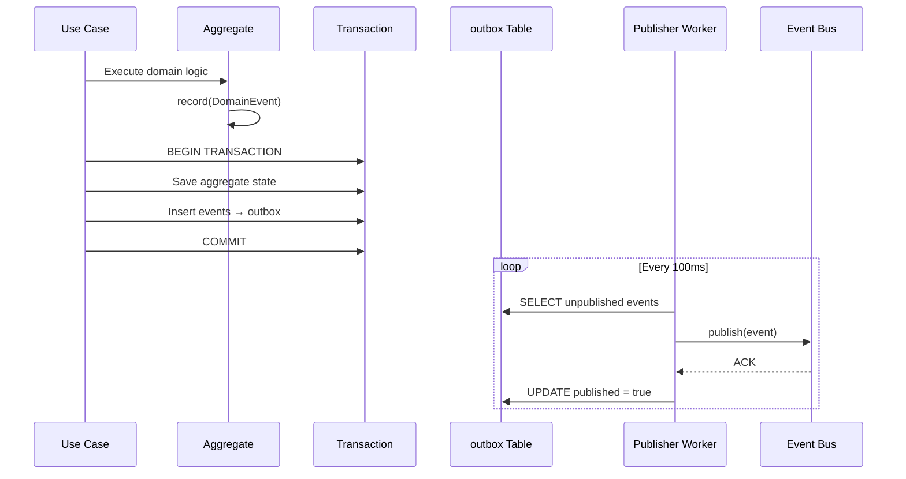
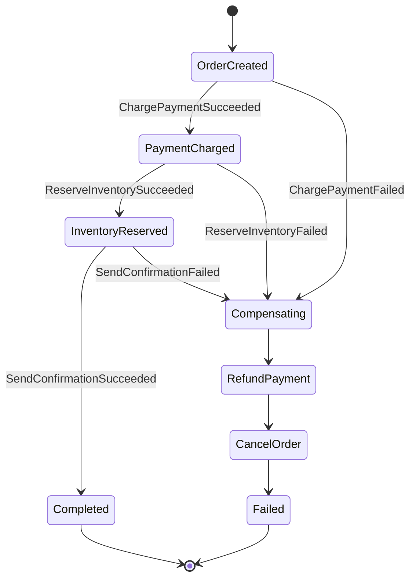
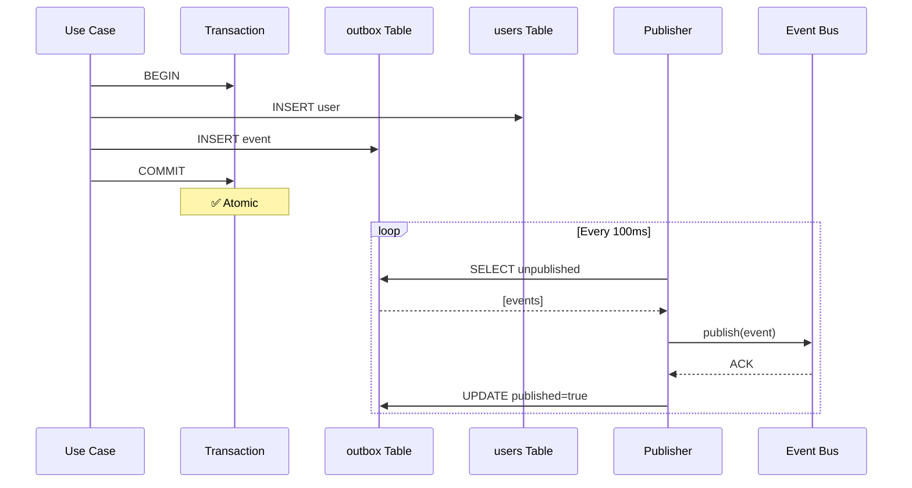
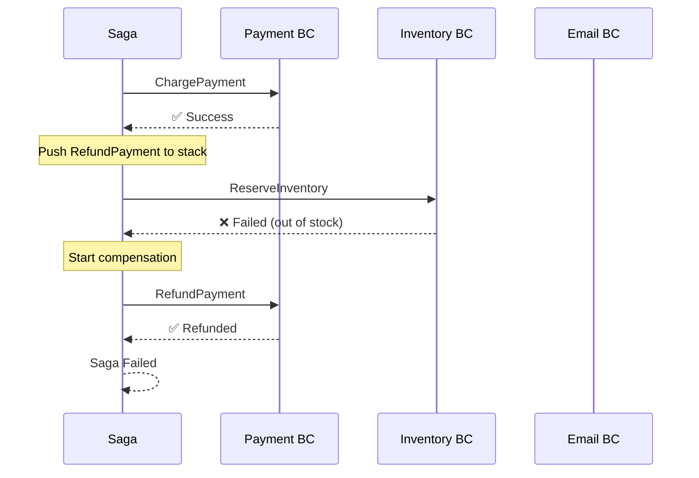

# 14. Advanced Patterns - Production-Grade Event Handling

> Part of the [Hexagonal & DDD in NestJS Implementation Guide](../NESTJS_DDD_COOKBOOK.md)

This chapter covers production-grade patterns for reliable event-driven architectures: **Outbox**, **Inbox**, and **Sagas**. These patterns solve real-world challenges when scaling beyond simple in-memory event handling.

---

## When to Use These Patterns

### MVP / Single-BC Phase
- ✅ In-memory event bus
- ✅ Single transaction per use case
- ✅ Events published synchronously after commit

**Good for:**
- Prototyping
- Single bounded context
- Low event volume
- Tolerate occasional event loss

### Scale-Up / Multi-BC Phase
- ✅ Outbox pattern (guaranteed delivery)
- ✅ Inbox pattern (idempotency)
- ✅ Sagas (cross-BC orchestration)

**Required when:**
- Multiple bounded contexts communicating
- Events must not be lost
- Distributed transactions needed
- Compensating actions required
- High event volume

---

## The Outbox Pattern (Reliable Event Publishing)

### Problem

**Without Outbox:**
```typescript
// ❌ DANGEROUS - Event publishing can fail
async execute(input) {
  await this.prisma.$transaction(async (tx) => {
    // 1. Save aggregate state
    await tx.user.create(...);

    // 2. Publish events
    await this.eventBus.publish(events); // ⚠️ What if this fails?
  });
}
```

**Failure scenarios:**
1. Event bus unavailable → Event lost, state saved ❌
2. Transaction rollback after publish → Event sent, state not saved ❌
3. Partial publish failure → Some events sent, some lost ❌

### Solution: Transactional Outbox

**Core idea:** Store events in the same database transaction as the aggregate state, then publish them asynchronously.



---

### Outbox Schema

```prisma
// schema.prisma
model Outbox {
  id            String   @id @default(uuid())
  eventName     String   // e.g., "user.domain.created"
  payload       Json     // Event data
  occurredAt    DateTime // When event was recorded
  attempts      Int      @default(0)
  nextAttemptAt DateTime @default(now())
  published     Boolean  @default(false)
  publishedAt   DateTime?

  @@index([published, nextAttemptAt])
  @@map("outbox")
}
```

---

### Outbox Repository

```typescript
// common/infrastructure/outbox/outbox.repository.ts
import { Injectable } from '@nestjs/common';
import { PrismaService } from '@shared-kernel/infrastructure/prisma.service';
import { DomainEvent } from '@kernel/domain/event/domain-event.interface';

@Injectable()
export class OutboxRepository {
  constructor(private readonly prisma: PrismaService) {}

  /**
   * Store events in outbox within the same transaction as aggregate persistence
   */
  async save(
    events: DomainEvent[],
    tx: PrismaService, // Transactional client
  ): Promise<void> {
    const records = events.map(event => ({
      eventName: event.eventName,
      payload: JSON.parse(JSON.stringify(event)), // Serialize
      occurredAt: event.occurredAt,
    }));

    await tx.outbox.createMany({
      data: records,
    });
  }

  /**
   * Fetch unpublished events ready for publishing
   */
  async findUnpublished(limit: number = 100): Promise<OutboxRecord[]> {
    return this.prisma.outbox.findMany({
      where: {
        published: false,
        nextAttemptAt: {
          lte: new Date(),
        },
      },
      orderBy: {
        occurredAt: 'asc',
      },
      take: limit,
    });
  }

  /**
   * Mark event as published
   */
  async markPublished(id: string): Promise<void> {
    await this.prisma.outbox.update({
      where: { id },
      data: {
        published: true,
        publishedAt: new Date(),
      },
    });
  }

  /**
   * Retry failed event with exponential backoff
   */
  async markFailed(id: string, attempts: number): Promise<void> {
    const backoffMinutes = Math.min(Math.pow(2, attempts), 60); // Max 60 min

    await this.prisma.outbox.update({
      where: { id },
      data: {
        attempts,
        nextAttemptAt: new Date(Date.now() + backoffMinutes * 60 * 1000),
      },
    });
  }
}

export type OutboxRecord = {
  id: string;
  eventName: string;
  payload: any;
  occurredAt: Date;
  attempts: number;
};
```

---

### Use Case with Outbox

```typescript
// application/use-cases/create-user/create-user.use-case.ts
import { Injectable, Inject } from '@nestjs/common';
import { PrismaService } from '@shared-kernel/infrastructure/prisma.service';
import { OutboxRepository } from '@common/infra/outbox/outbox.repository';
import { User } from '../../../domain/entities/user.entity';
import { Email } from '@kernel/domain/value-objects/email.vo';

@Injectable()
export class CreateUserUseCase {
  constructor(
    private readonly prisma: PrismaService,
    private readonly outbox: OutboxRepository,
  ) {}

  async execute(input: CreateUserInput): Promise<CreateUserOutput> {
    // Create domain aggregate
    const user = User.create(input.id, new Email(input.email));

    // Single transaction: state + events
    await this.prisma.$transaction(async (tx) => {
      // 1. Persist aggregate state
      await tx.user.create({
        data: {
          id: user.getId(),
          email: user.getEmail().toString(),
          status: 'active',
        },
      });

      // 2. Persist events to outbox (SAME TRANSACTION)
      const events = user.pullEvents();
      await this.outbox.save(events, tx);
    });

    // ✅ Both state and events are committed atomically
    // ✅ If transaction fails, nothing is saved
    // ✅ If transaction succeeds, events will eventually be published

    return { id: user.getId() };
  }
}
```

---

### Publisher Worker

```typescript
// common/infrastructure/outbox/outbox-publisher.worker.ts
import { Injectable, OnModuleInit, Inject } from '@nestjs/common';
import { OutboxRepository } from './outbox.repository';
import { EventBusPort, EVENT_BUS } from '@common/app/ports/event-bus.port';

@Injectable()
export class OutboxPublisherWorker implements OnModuleInit {
  private isRunning = false;
  private intervalMs = 100; // Poll every 100ms

  constructor(
    private readonly outbox: OutboxRepository,
    @Inject(EVENT_BUS) private readonly eventBus: EventBusPort,
  ) {}

  onModuleInit() {
    this.start();
  }

  private async start(): Promise<void> {
    this.isRunning = true;
    console.log('[OutboxPublisher] Started');

    while (this.isRunning) {
      try {
        await this.processBatch();
      } catch (error) {
        console.error('[OutboxPublisher] Batch error:', error);
      }

      await this.sleep(this.intervalMs);
    }
  }

  private async processBatch(): Promise<void> {
    const records = await this.outbox.findUnpublished(100);

    for (const record of records) {
      try {
        // Reconstruct event from payload
        const event = this.deserializeEvent(record);

        // Publish to event bus (Kafka/NATS/RabbitMQ)
        await this.eventBus.publishOne(event);

        // Mark as published
        await this.outbox.markPublished(record.id);

        console.log(`[OutboxPublisher] Published: ${record.eventName}`);
      } catch (error) {
        console.error(`[OutboxPublisher] Failed to publish ${record.id}:`, error);

        // Exponential backoff retry
        await this.outbox.markFailed(record.id, record.attempts + 1);
      }
    }
  }

  private deserializeEvent(record: OutboxRecord): DomainEvent {
    // Map event names to event classes
    const eventRegistry = {
      'user.domain.created': UserCreatedEvent,
      'user.domain.email-changed': UserEmailChangedEvent,
      // ... register all events
    };

    const EventClass = eventRegistry[record.eventName];
    if (!EventClass) {
      throw new Error(`Unknown event type: ${record.eventName}`);
    }

    return Object.assign(new EventClass(), record.payload);
  }

  private sleep(ms: number): Promise<void> {
    return new Promise(resolve => setTimeout(resolve, ms));
  }

  stop() {
    this.isRunning = false;
  }
}
```

---

## The Inbox Pattern (Idempotency)

### Problem

Events can be delivered multiple times due to:
- Network retries
- Publisher retries
- Event bus at-least-once semantics

**Without Inbox:**
```typescript
// ❌ Dangerous - processes same event multiple times
async handle(event: UserCreatedEvent) {
  await this.sendWelcomeEmail(event.email); // Sends duplicate emails!
}
```

### Solution: Idempotent Event Processing

**Core idea:** Track processed events in database, skip duplicates.

---

### Inbox Schema

```prisma
// schema.prisma
model Inbox {
  id          String   @id // Use event ID as primary key
  eventName   String
  processedAt DateTime @default(now())

  @@index([processedAt]) // For cleanup
  @@map("inbox")
}
```

---

### Inbox Repository

```typescript
// common/infrastructure/inbox/inbox.repository.ts
import { Injectable } from '@nestjs/common';
import { PrismaService } from '@shared-kernel/infrastructure/prisma.service';

@Injectable()
export class InboxRepository {
  constructor(private readonly prisma: PrismaService) {}

  /**
   * Check if event was already processed
   */
  async isProcessed(eventId: string): Promise<boolean> {
    const record = await this.prisma.inbox.findUnique({
      where: { id: eventId },
    });
    return !!record;
  }

  /**
   * Mark event as processed (idempotent)
   */
  async markProcessed(eventId: string, eventName: string): Promise<void> {
    await this.prisma.inbox.upsert({
      where: { id: eventId },
      create: {
        id: eventId,
        eventName,
      },
      update: {}, // No-op if already exists
    });
  }

  /**
   * Cleanup old processed events (optional)
   */
  async cleanup(olderThanDays: number): Promise<number> {
    const cutoff = new Date();
    cutoff.setDate(cutoff.getDate() - olderThanDays);

    const result = await this.prisma.inbox.deleteMany({
      where: {
        processedAt: {
          lt: cutoff,
        },
      },
    });

    return result.count;
  }
}
```

---

### Idempotent Event Handler

```typescript
// supporting/notification/application/subscribers/user-created.subscriber.ts
import { Injectable, Inject, OnModuleInit } from '@nestjs/common';
import { EventBusPort, EVENT_BUS } from '@common/app/ports/event-bus.port';
import { InboxRepository } from '@common/infra/inbox/inbox.repository';
import { UserCreatedEvent } from '@supporting/user/domain/events/user-created.event';
import { SendWelcomeEmailUseCase } from '../use-cases/send-welcome-email.use-case';

@Injectable()
export class UserCreatedSubscriber implements OnModuleInit {
  constructor(
    @Inject(EVENT_BUS) private readonly eventBus: EventBusPort,
    private readonly inbox: InboxRepository,
    private readonly sendWelcomeEmail: SendWelcomeEmailUseCase,
  ) {}

  onModuleInit() {
    this.eventBus.on<UserCreatedEvent>(
      UserCreatedEvent.EVENT_NAME,
      this.handleUserCreated.bind(this),
    );
  }

  private async handleUserCreated(event: UserCreatedEvent): Promise<void> {
    const eventId = event.userId; // Or use a dedicated event.id field

    // Check if already processed
    const alreadyProcessed = await this.inbox.isProcessed(eventId);
    if (alreadyProcessed) {
      console.log(`[UserCreatedSubscriber] Skipping duplicate: ${eventId}`);
      return; // ✅ Idempotency guaranteed
    }

    try {
      // Process event
      await this.sendWelcomeEmail.execute({
        userId: event.userId,
        email: event.email,
      });

      // Mark as processed
      await this.inbox.markProcessed(eventId, event.eventName);

      console.log(`[UserCreatedSubscriber] Processed: ${eventId}`);
    } catch (error) {
      console.error(`[UserCreatedSubscriber] Failed to process ${eventId}:`, error);
      // Event bus will retry, inbox will catch duplicate
      throw error;
    }
  }
}
```

---

## Sagas (Orchestrated Cross-BC Transactions)

### Problem

**Distributed operations** span multiple bounded contexts and can fail partially:

```
CreateOrder → ChargePayment → ReserveInventory → SendConfirmation
                    ❌ Fails here
```

**Without Saga:**
- Order created ✅
- Payment failed ❌
- Inventory reserved ✅ (inconsistent!)
- Confirmation not sent ✅

### Solution: Saga Orchestrator with Compensations

**Core idea:** Orchestrator tracks progress and triggers compensating actions on failure.

---

### Saga State Machine



---

### Saga Schema

```prisma
// schema.prisma
model Saga {
  id              String   @id @default(uuid())
  sagaType        String   // "CreateOrderSaga"
  status          String   // "IN_PROGRESS", "COMPLETED", "FAILED", "COMPENSATING"
  currentStep     String   // "PAYMENT", "INVENTORY", etc.
  payload         Json     // Saga data
  compensations   Json     // Stack of compensating actions
  createdAt       DateTime @default(now())
  updatedAt       DateTime @updatedAt

  @@index([status, sagaType])
  @@map("sagas")
}
```

---

### Saga Orchestrator

```typescript
// supporting/order/application/sagas/create-order.saga.ts
import { Injectable, Inject } from '@nestjs/common';
import { EventBusPort, EVENT_BUS } from '@common/app/ports/event-bus.port';
import { ChargePaymentUseCase } from '@supporting/payment/application/use-cases/charge-payment.use-case';
import { ReserveInventoryUseCase } from '@supporting/inventory/application/use-cases/reserve-inventory.use-case';
import { RefundPaymentUseCase } from '@supporting/payment/application/use-cases/refund-payment.use-case';
import { CancelOrderUseCase } from '../use-cases/cancel-order.use-case';

export type CreateOrderSagaData = {
  orderId: string;
  userId: string;
  items: Array<{ productId: string; quantity: number }>;
  totalAmount: number;
};

@Injectable()
export class CreateOrderSaga {
  private compensationStack: Array<() => Promise<void>> = [];

  constructor(
    @Inject(EVENT_BUS) private readonly eventBus: EventBusPort,
    private readonly chargePayment: ChargePaymentUseCase,
    private readonly reserveInventory: ReserveInventoryUseCase,
    private readonly refundPayment: RefundPaymentUseCase,
    private readonly cancelOrder: CancelOrderUseCase,
  ) {}

  async execute(data: CreateOrderSagaData): Promise<void> {
    try {
      console.log(`[CreateOrderSaga] Starting: ${data.orderId}`);

      // Step 1: Charge Payment
      await this.chargePaymentStep(data);

      // Step 2: Reserve Inventory
      await this.reserveInventoryStep(data);

      // Step 3: Send Confirmation (via event)
      await this.sendConfirmationStep(data);

      console.log(`[CreateOrderSaga] Completed: ${data.orderId}`);
    } catch (error) {
      console.error(`[CreateOrderSaga] Failed: ${data.orderId}`, error);

      // Execute compensations in reverse order
      await this.compensate();

      throw error;
    }
  }

  private async chargePaymentStep(data: CreateOrderSagaData): Promise<void> {
    console.log(`[CreateOrderSaga] Charging payment: ${data.orderId}`);

    const paymentId = await this.chargePayment.execute({
      userId: data.userId,
      amount: data.totalAmount,
      orderId: data.orderId,
    });

    // Register compensation action
    this.compensationStack.push(async () => {
      console.log(`[CreateOrderSaga] Compensating: Refunding payment ${paymentId}`);
      await this.refundPayment.execute({ paymentId });
    });
  }

  private async reserveInventoryStep(data: CreateOrderSagaData): Promise<void> {
    console.log(`[CreateOrderSaga] Reserving inventory: ${data.orderId}`);

    const reservationId = await this.reserveInventory.execute({
      orderId: data.orderId,
      items: data.items,
    });

    // Register compensation action
    this.compensationStack.push(async () => {
      console.log(`[CreateOrderSaga] Compensating: Releasing inventory ${reservationId}`);
      // Inventory releases automatically after timeout, or use explicit use case
    });
  }

  private async sendConfirmationStep(data: CreateOrderSagaData): Promise<void> {
    console.log(`[CreateOrderSaga] Sending confirmation: ${data.orderId}`);

    await this.eventBus.publishOne(
      new OrderCompletedEvent(data.orderId, data.userId),
    );
  }

  private async compensate(): Promise<void> {
    console.log(`[CreateOrderSaga] Starting compensation`);

    // Execute compensations in reverse order (LIFO)
    while (this.compensationStack.length > 0) {
      const compensation = this.compensationStack.pop()!;

      try {
        await compensation();
      } catch (error) {
        console.error('[CreateOrderSaga] Compensation failed:', error);
        // Continue with other compensations
      }
    }

    console.log(`[CreateOrderSaga] Compensation completed`);
  }
}
```

---

### Saga Orchestrator Subscriber

```typescript
// supporting/order/application/subscribers/order-created.subscriber.ts
import { Injectable, Inject, OnModuleInit } from '@nestjs/common';
import { EventBusPort, EVENT_BUS } from '@common/app/ports/event-bus.port';
import { OrderCreatedEvent } from '../../domain/events/order-created.event';
import { CreateOrderSaga } from '../sagas/create-order.saga';

@Injectable()
export class OrderCreatedSubscriber implements OnModuleInit {
  constructor(
    @Inject(EVENT_BUS) private readonly eventBus: EventBusPort,
    private readonly createOrderSaga: CreateOrderSaga,
  ) {}

  onModuleInit() {
    this.eventBus.on<OrderCreatedEvent>(
      OrderCreatedEvent.EVENT_NAME,
      this.handleOrderCreated.bind(this),
    );
  }

  private async handleOrderCreated(event: OrderCreatedEvent): Promise<void> {
    console.log(`[OrderCreatedSubscriber] Starting saga for: ${event.orderId}`);

    try {
      await this.createOrderSaga.execute({
        orderId: event.orderId,
        userId: event.userId,
        items: event.items,
        totalAmount: event.totalAmount,
      });
    } catch (error) {
      console.error(`[OrderCreatedSubscriber] Saga failed for ${event.orderId}:`, error);
      // Saga has already compensated
    }
  }
}
```

---

## Execution Flow Diagrams

### Outbox Flow



---

### Saga with Compensation Flow



---

## Decision Matrix: Which Pattern?

| Scenario | Pattern | Reason |
|----------|---------|--------|
| MVP / Single BC | In-memory EventBus | Simple, fast, good enough |
| Events must not be lost | Outbox | Guaranteed delivery |
| Events can be duplicated | Inbox | Idempotency |
| Multi-BC transaction | Saga | Compensating actions |
| High event volume | Outbox + Worker pool | Scalability |
| Event replay needed | Outbox (keep published) | Audit / debugging |

---

## Module Configuration

```typescript
// common/infrastructure/common-infrastructure.module.ts
import { Module } from '@nestjs/common';
import { OutboxRepository } from './outbox/outbox.repository';
import { OutboxPublisherWorker } from './outbox/outbox-publisher.worker';
import { InboxRepository } from './inbox/inbox.repository';
import { EventBusModule } from './event-bus/event-bus.module';

@Module({
  imports: [EventBusModule],
  providers: [
    OutboxRepository,
    OutboxPublisherWorker,
    InboxRepository,
  ],
  exports: [
    OutboxRepository,
    InboxRepository,
  ],
})
export class CommonInfrastructureModule {}
```

---

## Best Practices

### Outbox
- ✅ Use database transaction for state + events
- ✅ Poll frequently (100ms) for low latency
- ✅ Implement exponential backoff for retries
- ✅ Clean up old published events periodically
- ❌ Don't delete events immediately (keep for audit)

### Inbox
- ✅ Use event ID as idempotency key
- ✅ Check inbox BEFORE processing
- ✅ Mark processed AFTER successful handling
- ✅ Clean up old inbox records (>30 days)
- ❌ Don't skip inbox check (always verify)

### Sagas
- ✅ Push compensations to stack as you progress
- ✅ Execute compensations in reverse order (LIFO)
- ✅ Make compensations idempotent
- ✅ Log saga progress for debugging
- ❌ Don't throw from compensation handlers
- ❌ Don't nest sagas (use events instead)

---

## Migration Path: MVP → Production

### Phase 1: MVP (In-Memory)
```typescript
// Simple: publish events directly after TX
await this.prisma.user.create(...);
await this.eventBus.publish(events);
```

### Phase 2: Add Outbox (Reliability)
```typescript
// Add outbox table + publisher worker
await this.prisma.$transaction(async (tx) => {
  await tx.user.create(...);
  await this.outbox.save(events, tx);
});
```

### Phase 3: Add Inbox (Idempotency)
```typescript
// Add inbox table + check in handlers
if (await this.inbox.isProcessed(eventId)) return;
// ... process event
await this.inbox.markProcessed(eventId);
```

### Phase 4: Add Sagas (Orchestration)
```typescript
// Add saga orchestrator for multi-BC flows
await this.createOrderSaga.execute(data);
```

---

## Summary

| Pattern | Guarantees | Use Case |
|---------|-----------|----------|
| **Outbox** | Events never lost | Reliable event publishing |
| **Inbox** | Events processed once | Idempotent handlers |
| **Saga** | Consistency across BCs | Distributed transactions |

**Golden Rule:** Start simple (in-memory), add patterns when you need them (not before).

---

**Navigation:** [Previous: Domain Services & Use Cases](./13-domain-services-and-use-cases.md) | [Up](../NESTJS_DDD_COOKBOOK.md) | [Next: Common Pitfalls](./11-common-pitfalls.md)
